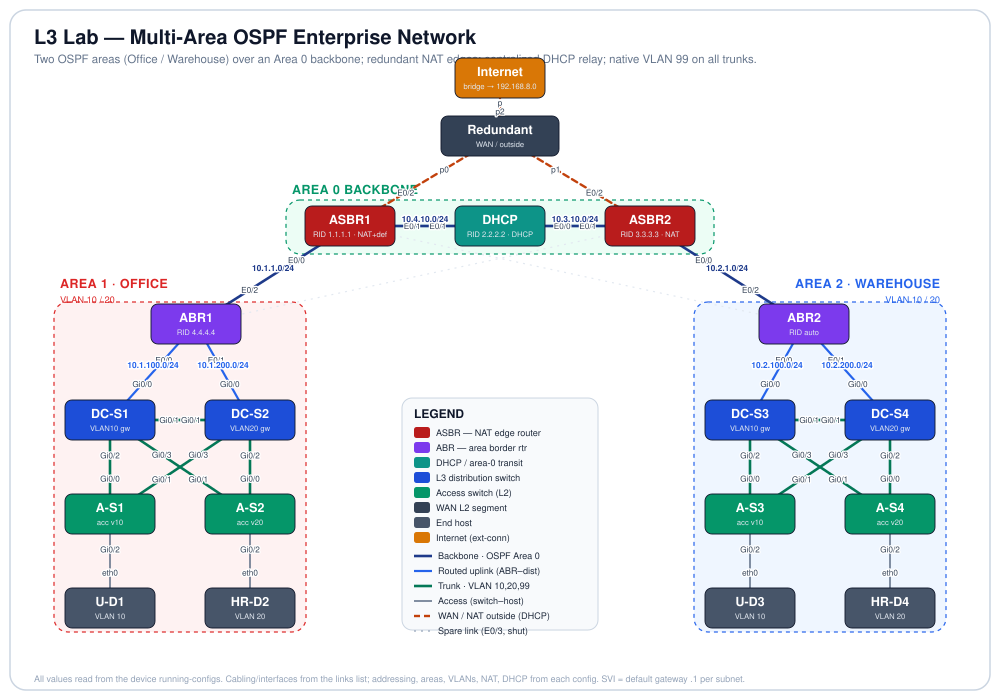

# L3 Lab — Multi-Area OSPF Enterprise Network


-005073)
-0b7285)


## Objective

This lab is a full two-site enterprise network. An **Office** site and a **Warehouse** site each carry two user VLANs behind a Layer-3 distribution layer, and the two sites are joined by a multi-area OSPF core with a **redundant, NAT-based Internet edge** and **centralized DHCP** delivered by relay. It proves that a client in any site VLAN can lease an address from a central server several routed hops away, reach the other site across the OSPF backbone, and reach the Internet through a translated edge. Every device in the lab is configured and forwarding.

### Changes from the previous export

This export applies two targeted corrections on top of the fully-built previous version; the routers and all cabling are unchanged (19 nodes, 27 links). Self-signed certificates were re-minted (cosmetic).

| Device(s) | What changed | Why it matters |
|-----------|--------------|----------------|
| DC-S1, DC-S2, A-S1, A-S2 | Office trunks moved to **native VLAN 99** (allowed `10,20,99`) | Native-VLAN hardening is now uniform across both sites |
| DC-S1, DC-S2, DC-S3, DC-S4 | Removed the stale `ip helper-address 10.3.10.5` (a dead address from an earlier build) | Every SVI now relays cleanly to a single live DHCP interface |

The remaining open items (ASBR2 default origination, ABR2 router-ID, backbone redundancy) were not part of this pass. See *Possible Extensions*.

## Topology

<p align="center">
  
</p>

*Line key: navy = OSPF Area 0 backbone · blue = ABR-to-distribution routed uplink · green = 802.1Q trunk (VLAN 10,20, plus 99 in the Warehouse) · gray = access port to host · dashed orange = WAN / NAT-outside segment (both ASBRs DHCP-learn their uplink through the Redundant switch to the Internet) · faint dashed = spare E0/3 links, cabled but shut. Each endpoint shows its interface; routed links show their subnet; SVIs are the `.1` gateway of each subnet.*

## Node Inventory

| Node | Role | Type | `node_definition` |
|------|------|------|-------------------|
| Internet | Internet edge (bridged to `192.168.8.0`) | External connector | `external_connector` |
| Redundant | WAN / outside L2 segment (both ASBRs + Internet) | Unmanaged switch | `unmanaged_switch` |
| ASBR1 | NAT edge router + default originator (RID 1.1.1.1) | Router | `iol-xe` |
| ASBR2 | NAT edge router, redundant egress (RID 3.3.3.3) | Router | `iol-xe` |
| DHCP | Central DHCP server + Area 0 transit (RID 2.2.2.2) | Router | `iol-xe` |
| ABR1 | Area Border Router, Area 0 ↔ Area 1 / Office (RID 4.4.4.4) | Router | `iol-xe` |
| ABR2 | Area Border Router, Area 0 ↔ Area 2 / Warehouse | Router | `iol-xe` |
| DC-S1 | Office L3 distribution — VLAN 10 gateway | Multilayer switch | `iosvl2` |
| DC-S2 | Office L3 distribution — VLAN 20 gateway | Multilayer switch | `iosvl2` |
| DC-S3 | Warehouse L3 distribution — VLAN 10 gateway | Multilayer switch | `iosvl2` |
| DC-S4 | Warehouse L3 distribution — VLAN 20 gateway | Multilayer switch | `iosvl2` |
| A-S1 | Office access switch (U-D1, VLAN 10) | Switch | `iosvl2` |
| A-S2 | Office access switch (HR-D2, VLAN 20) | Switch | `iosvl2` |
| A-S3 | Warehouse access switch (U-D3, VLAN 10) | Switch | `iosvl2` |
| A-S4 | Warehouse access switch (HR-D4, VLAN 20) | Switch | `iosvl2` |
| U-D1 | Office end host (VLAN 10) | Desktop | `desktop` |
| HR-D2 | Office end host (VLAN 20) | Desktop | `desktop` |
| U-D3 | Warehouse end host (VLAN 10) | Desktop | `desktop` |
| HR-D4 | Warehouse end host (VLAN 20) | Desktop | `desktop` |

## Addressing & Segmentation

All values are read from the running-configs.

### OSPF (process 1)

| Router | Router-ID | Interface → area | Notes |
|--------|-----------|------------------|-------|
| ABR1 | 4.4.4.4 | E0/2 `10.1.1.0` → a0; E0/0 `10.1.100.0`, E0/1 `10.1.200.0` → a1 | Office ABR |
| ABR2 | *auto* | E0/2 `10.2.1.0` → a0; E0/0 `10.2.100.0`, E0/1 `10.2.200.0` → a2 | Warehouse ABR (no explicit RID) |
| ASBR1 | 1.1.1.1 | E0/0 `10.1.1.0` → a0; E0/1 `10.4.10.0` → a0 | `default-information originate`; NAT |
| ASBR2 | 3.3.3.3 | E0/0 `10.2.1.0` → a0; E0/1 `10.3.10.0` → a0 | NAT; does **not** originate default |
| DHCP | 2.2.2.2 | E0/0 `10.3.10.0`, E0/1 `10.4.10.0` → a0 | `passive-interface default` except the two backbone links |

The four distribution switches also run OSPF: DC-S1/DC-S2 advertise their SVI and uplink subnets into **area 1**; DC-S3/DC-S4 into **area 2**. The Office distribution switches additionally carry a static default toward ABR1; the Warehouse switches rely on the OSPF-learned default.

### IP addressing

| Subnet | Area | Endpoints |
|--------|------|-----------|
| `10.1.10.0/24` | 1 | Office VLAN 10 — SVI/gateway DC-S1 `.1` |
| `10.1.20.0/24` | 1 | Office VLAN 20 — SVI/gateway DC-S2 `.1` |
| `10.2.10.0/24` | 2 | Warehouse VLAN 10 — SVI/gateway DC-S3 `.1` |
| `10.2.20.0/24` | 2 | Warehouse VLAN 20 — SVI/gateway DC-S4 `.1` |
| `10.1.100.0/24` | 1 | DC-S1 `.1` ↔ ABR1 E0/0 `.2` |
| `10.1.200.0/24` | 1 | DC-S2 `.1` ↔ ABR1 E0/1 `.2` |
| `10.2.100.0/24` | 2 | DC-S3 `.1` ↔ ABR2 E0/0 `.2` |
| `10.2.200.0/24` | 2 | DC-S4 `.1` ↔ ABR2 E0/1 `.2` |
| `10.1.1.0/24` | 0 | ABR1 E0/2 `.2` ↔ ASBR1 E0/0 `.1` |
| `10.2.1.0/24` | 0 | ABR2 E0/2 `.2` ↔ ASBR2 E0/0 `.1` |
| `10.4.10.0/24` | 0 | ASBR1 E0/1 `.1` ↔ DHCP E0/1 `.2` |
| `10.3.10.0/24` | 0 | ASBR2 E0/1 `.1` ↔ DHCP E0/0 `.2` |
| WAN (Redundant switch) | — | ASBR1 E0/2 + ASBR2 E0/2 (both `ip address dhcp`, NAT outside) + Internet bridge to `192.168.8.0` |

### VLANs

| VLAN | Office subnet / gateway | Warehouse subnet / gateway | Host ports |
|------|--------------------------|-----------------------------|------------|
| 10 | `10.1.10.0/24` — DC-S1 `.1` | `10.2.10.0/24` — DC-S3 `.1` | A-S1 / A-S3 Gi0/2 → U-D1 / U-D3 |
| 20 | `10.1.20.0/24` — DC-S2 `.1` | `10.2.20.0/24` — DC-S4 `.1` | A-S2 / A-S4 Gi0/2 → HR-D2 / HR-D4 |
| 99 | native/unused VLAN on all trunks | native/unused VLAN on all trunks | — |

*CML exports drop the `vlan` name-definition stanzas, so the VLAN names are not in the file, but `show vlan brief` on the switches confirms them: VLAN 10 = `USERS`, VLAN 20 = `HR`, VLAN 99 = `NATIVE`.*

### DHCP (server = the `DHCP` router)

| Pool | Network | default-router | Excluded |
|------|---------|----------------|----------|
| `AREA1V10` | 10.1.10.0/24 | 10.1.10.1 | .1 – .10 |
| `AREA10V2` | 10.1.20.0/24 | 10.1.20.1 | .1 – .10 |
| `AREA2V10` | 10.2.10.0/24 | 10.2.10.1 | .1 – .10 |
| `AREA2V20` | 10.2.20.0/24 | 10.2.20.1 | .1 – .10 |

Each SVI relays to the DHCP router: the Office SVIs (DC-S1, DC-S2) point at `10.4.10.2` and the Warehouse SVIs (DC-S3, DC-S4) point at `10.3.10.2`. Every SVI now has a single live relay target, so relay works but is not yet redundant. See *Possible Extensions*.

### NAT (both ASBRs)

Each ASBR runs PAT: `ip nat inside source list 10 interface Ethernet0/2 overload`, with E0/2 (`ip address dhcp`) as `ip nat outside` and the internal links as `ip nat inside`. ACL 10 permits the internal ranges (`10.1.0.0/16`, `10.2.0.0/16`, `10.3.10.0/24`, `10.4.10.0/24`), so any site host is translated to the ASBR's DHCP-learned WAN address on the way out.

## Cabling / Link Map

Every link from the `links` list, interfaces resolved from each node's interface table.

| Link | A-side | B-side | Purpose |
|------|--------|--------|---------|
| l0 | DC-S1 Gi0/1 | DC-S2 Gi0/1 | Office inter-distribution trunk (VLAN 10,20) |
| l1 | DC-S1 Gi0/2 | A-S1 Gi0/0 | Office distribution ↔ access trunk |
| l4 | DC-S2 Gi0/3 | A-S1 Gi0/1 | Office distribution ↔ access trunk (2nd uplink) |
| l3 | DC-S1 Gi0/3 | A-S2 Gi0/1 | Office distribution ↔ access trunk (2nd uplink) |
| l2 | DC-S2 Gi0/2 | A-S2 Gi0/0 | Office distribution ↔ access trunk |
| l6 | A-S1 Gi0/2 | U-D1 eth0 | Office access port, VLAN 10 (PortFast + BPDU Guard) |
| l5 | A-S2 Gi0/2 | HR-D2 eth0 | Office access port, VLAN 20 (PortFast + BPDU Guard) |
| l7 | DC-S3 Gi0/1 | DC-S4 Gi0/1 | Warehouse inter-distribution trunk (VLAN 10,20,99) |
| l8 | DC-S3 Gi0/2 | A-S3 Gi0/0 | Warehouse distribution ↔ access trunk |
| l11 | DC-S4 Gi0/3 | A-S3 Gi0/1 | Warehouse distribution ↔ access trunk (2nd uplink) |
| l10 | DC-S3 Gi0/3 | A-S4 Gi0/1 | Warehouse distribution ↔ access trunk (2nd uplink) |
| l9 | DC-S4 Gi0/2 | A-S4 Gi0/0 | Warehouse distribution ↔ access trunk |
| l12 | A-S3 Gi0/2 | U-D3 eth0 | Warehouse access port, VLAN 10 (PortFast + BPDU Guard) |
| l13 | A-S4 Gi0/2 | HR-D4 eth0 | Warehouse access port, VLAN 20 (PortFast + BPDU Guard) |
| l17 | ABR1 E0/0 | DC-S1 Gi0/0 | Routed uplink `10.1.100.0/24` (area 1) |
| l18 | ABR1 E0/1 | DC-S2 Gi0/0 | Routed uplink `10.1.200.0/24` (area 1) |
| l15 | ABR2 E0/0 | DC-S3 Gi0/0 | Routed uplink `10.2.100.0/24` (area 2) |
| l16 | ABR2 E0/1 | DC-S4 Gi0/0 | Routed uplink `10.2.200.0/24` (area 2) |
| l19 | ABR1 E0/2 | ASBR1 E0/0 | OSPF Area 0 backbone `10.1.1.0/24` |
| l20 | ABR2 E0/2 | ASBR2 E0/0 | OSPF Area 0 backbone `10.2.1.0/24` |
| l26 | ASBR1 E0/1 | DHCP E0/1 | OSPF Area 0 backbone `10.4.10.0/24` |
| l25 | ASBR2 E0/1 | DHCP E0/0 | OSPF Area 0 backbone `10.3.10.0/24` |
| l21 | ASBR1 E0/2 | Redundant port0 | WAN / NAT-outside segment (DHCP-learned) |
| l22 | ASBR2 E0/2 | Redundant port1 | WAN / NAT-outside segment (DHCP-learned) |
| l14 | Redundant port2 | Internet port | Uplink to the bridged Internet (`192.168.8.0`) |
| l23 | ASBR2 E0/3 | ABR1 E0/3 | Spare backbone cross-link — cabled, both ends shut |
| l24 | ASBR1 E0/3 | ABR2 E0/3 | Spare backbone cross-link — cabled, both ends shut |

## Design Details

**Layer-3 distribution with per-VLAN SVI gateways.** Each site's two distribution switches split the VLAN gateways between them (VLAN 10 on DC-S1/DC-S3, VLAN 20 on DC-S2/DC-S4). Each holds its VLAN's SVI as the `.1` gateway, a routed uplink to the site ABR, OSPF, and DHCP relay.

```text
! DC-S3 (Warehouse)
interface GigabitEthernet0/0
 no switchport
 ip address 10.2.100.1 255.255.255.0
interface Vlan10
 ip address 10.2.10.1 255.255.255.0
 ip helper-address 10.3.10.2
router ospf 1
 network 10.2.10.0 0.0.0.255 area 2
 network 10.2.100.0 0.0.0.255 area 2
```

**VLAN segmentation, trunking, and native-VLAN hardening.** All inter-switch links are dot1q trunks pruned to the user VLANs. Every trunk on both sites uses an unused **native VLAN 99**, moving untagged traffic off the default VLAN 1 (a common hardening step against VLAN-hopping).

```text
! Trunk (native VLAN 99, now on all switches)
interface GigabitEthernet0/0
 switchport trunk allowed vlan 10,20,99
 switchport trunk encapsulation dot1q
 switchport trunk native vlan 99
 switchport mode trunk
```

**Access-port hardening.** Every host port is a single-VLAN access port with PortFast (fast host convergence) and BPDU Guard (err-disable if a switch is connected).

```text
interface GigabitEthernet0/2
 switchport access vlan 10
 switchport mode access
 spanning-tree portfast edge
 spanning-tree bpduguard enable
```

**Multi-area OSPF.** Area 1 (Office) and Area 2 (Warehouse) each hang off their own ABR, and Area 0 stitches the ABRs, ASBRs and the DHCP router together. The DHCP router is the Area 0 transit between the two edges, so it stays passive on every interface except its two backbone links.

```text
! ABR2 (Warehouse border)
router ospf 1
 network 10.2.1.0 0.0.0.255 area 0
 network 10.2.100.0 0.0.0.255 area 2
 network 10.2.200.0 0.0.0.255 area 2
! DHCP (area-0 transit)
router ospf 1
 router-id 2.2.2.2
 passive-interface default
 no passive-interface Ethernet0/0
 no passive-interface Ethernet0/1
 network 10.3.10.0 0.0.0.255 area 0
 network 10.4.10.0 0.0.0.255 area 0
```

**Centralized DHCP with relay.** One DHCP router serves all four site subnets; each SVI relays to it with `ip helper-address`, and pools exclude the low addresses reserved for infrastructure.

```text
ip dhcp excluded-address 10.2.10.1 10.2.10.10
ip dhcp pool AREA2V10
 network 10.2.10.0 255.255.255.0
 default-router 10.2.10.1
```

**Redundant NAT / PAT Internet edge.** Both ASBRs translate site traffic out a DHCP-learned WAN interface toward the bridged Internet. ASBR1 also injects a default route into OSPF so the whole domain knows how to leave.

```text
! ASBR1
interface Ethernet0/2
 ip address dhcp
 ip nat outside
ip nat inside source list 10 interface Ethernet0/2 overload
ip access-list standard 10
 permit 10.1.0.0 0.0.255.255
 permit 10.2.0.0 0.0.255.255
 permit 10.3.10.0 0.0.0.255
 permit 10.4.10.0 0.0.0.255
router ospf 1
 router-id 1.1.1.1
 default-information originate
```

**Spanning tree.** Switches run PVST+, routers Rapid-PVST. Each access switch dual-homes to both of its site's distribution switches, so STP blocks one uplink per access-switch pair; root priorities are left at default.

## How to Run & Verify

**Import.** In CML, *Import* → select `L3_Lab.clean.yaml` → start all nodes. The Internet connector is a System Bridge, so Internet reachability depends on the host having the `192.168.8.0` upstream that the ASBRs DHCP-learn.

| Test (where) | Command | Expected result |
|--------------|---------|-----------------|
| Hosts leased addresses | U-D1 / U-D3: `ip a` | Addresses in the site VLAN subnet, gateway `.1` |
| DHCP bindings | DHCP: `show ip dhcp binding` | One binding per host, across all four pools |
| Relay reaches server | DC-S3: `show ip interface Vlan10` \| i Helper | Helper `10.3.10.2` (live) present |
| Trunks / native VLAN | A-S3: `show interfaces trunk` | Gi0/0–Gi0/1 trunking 10,20,99, native VLAN 99 |
| Access-port guard | A-S1: `show spanning-tree interface Gi0/2 detail` | PortFast edge + BPDU Guard enabled |
| Inter-VLAN routing | U-D1 (v10) → ping HR-D2 (v20) | Success via the site SVIs |
| OSPF adjacencies | DHCP: `show ip ospf neighbor` | FULL with both ASBRs; ABRs FULL in area 0 and their site area |
| Areas / inter-area LSAs | ABR1: `show ip ospf database` | ABR flag; type-3 summaries for the far site |
| Cross-site path | U-D1 → traceroute a Warehouse host | Office → ABR1 → Area 0 (via DHCP transit) → ABR2 → Warehouse |
| NAT translation | ASBR1: `show ip nat translations` | Entries for site hosts overloaded to E0/2 |
| Internet egress | U-D1 → ping the upstream / `8.8.8.8` | Success (translated), assuming the bridged upstream is reachable |

### Captured verification (CML)

The following was captured from the running lab. Hosts leased `.11` in each subnet: U-D1 `10.1.10.11`, HR-D2 `10.1.20.11`, U-D3 `10.2.10.11`, HR-D4 `10.2.20.11`.

**OSPF backbone is up through the DHCP transit.** The DHCP router sees both ASBRs FULL, one on each backbone link:

```text
DHCP# show ip ospf neighbor
Neighbor ID   Pri  State      Dead Time  Address     Interface
1.1.1.1         1  FULL/DR    00:00:39   10.4.10.1   Ethernet0/1
3.3.3.3         1  FULL/BDR   00:00:35   10.3.10.1   Ethernet0/0
```

**ABR1 is a real ABR and has the full picture.** It is FULL with ASBR1 (area 0) and both Office distribution switches (area 1), and its table carries the inter-area routes to the Warehouse (`O IA`) plus the external default from ASBR1 (`O*E2`):

```text
ABR1# show ip ospf | include It is an|Area
 It is an area border router
    Area BACKBONE(0)
    Area 1

ABR1# show ip route ospf
Gateway of last resort is 10.1.1.1 to network 0.0.0.0

O*E2  0.0.0.0/0     [110/1]  via 10.1.1.1, Ethernet0/2
O     10.1.10.0/24  [110/11] via 10.1.100.1, Ethernet0/0
O     10.1.20.0/24  [110/11] via 10.1.200.1, Ethernet0/1
O     10.2.1.0/24   [110/40] via 10.1.1.1, Ethernet0/2
O IA  10.2.10.0/24  [110/51] via 10.1.1.1, Ethernet0/2
O IA  10.2.20.0/24  [110/51] via 10.1.1.1, Ethernet0/2
O IA  10.2.100.0/24 [110/50] via 10.1.1.1, Ethernet0/2
O IA  10.2.200.0/24 [110/50] via 10.1.1.1, Ethernet0/2
O     10.3.10.0/24  [110/30] via 10.1.1.1, Ethernet0/2
O     10.4.10.0/24  [110/20] via 10.1.1.1, Ethernet0/2
```

**Centralized DHCP served all four site VLANs.** One binding per host, across all four pools:

```text
DHCP# show ip dhcp binding
IP address    Hardware address   Lease expiration       Type       State
10.1.10.11    0152.5400.3585.1e  Sep 10 2026 10:51 PM   Automatic  Active
10.1.20.11    0152.5400.d827.f2  Sep 10 2026 10:51 PM   Automatic  Active
10.2.10.11    0152.5400.4949.0c  Sep 11 2026 01:18 AM   Automatic  Active
10.2.20.11    0152.5400.ef67.8a  Sep 11 2026 01:31 AM   Automatic  Active
```

**PAT edge translated site traffic to the Internet.** Office hosts overloaded to ASBR1's DHCP-learned WAN address `192.168.8.137` out E0/2:

```text
ASBR1# show ip nat translations
Pro  Inside global        Inside local      Outside local      Outside global
icmp 192.168.8.137:1024   10.1.10.11:40442  192.168.8.1:40442  192.168.8.1:1024
icmp 192.168.8.137:1025   10.1.20.11:37309  192.168.8.1:37309  192.168.8.1:1025

ASBR1# show ip nat statistics
Total active translations: 2 (0 static, 2 dynamic; 2 extended)
Outside interfaces: Ethernet0/2
Inside interfaces:  Ethernet0/0, Ethernet0/1
[Id: 1] access-list 10 interface Ethernet0/2 refcount 2
```

**Trunks carry the native VLAN 99, and STP blocks the redundant uplink.** A-S1 trunks 10,20,99 with native VLAN 99, and spanning tree forwards one uplink while blocking the second (`Altn BLK`); the host port is an edge port:

```text
A-S1# show interfaces trunk
Port   Mode  Encapsulation  Status    Native vlan
Gi0/0  on    802.1q         trunking  99
Gi0/1  on    802.1q         trunking  99
Port   Vlans allowed on trunk
Gi0/0  10,20,99
Gi0/1  10,20,99

A-S1# show spanning-tree vlan 10
Interface  Role Sts Cost  Prio.Nbr Type
Gi0/0      Root FWD 4     128.1    P2p
Gi0/1      Altn BLK 4     128.2    P2p        <-- redundant uplink blocked by STP
Gi0/2      Desg FWD 4     128.3    P2p Edge
```

**End-to-end, cross-site, through the Area 0 transit.** A traceroute from an Office VLAN 10 host to a Warehouse VLAN 20 host walks every tier of the design in order — site SVI, ABR1, ASBR1, the DHCP router as the backbone transit, ASBR2, ABR2, the far distribution switch, then the host:

```text
U-D1:~$ traceroute 10.2.20.11
 1  10.1.10.1     4.631 ms   2.067 ms   2.162 ms     # DC-S1  VLAN10 SVI (gateway)
 2  10.1.100.2    2.276 ms   2.770 ms   1.963 ms     # ABR1   E0/0 (area 1)
 3  10.1.1.1      2.830 ms   3.420 ms   5.819 ms     # ASBR1  E0/0 (area 0)
 4  10.4.10.2     3.966 ms   3.804 ms   3.304 ms     # DHCP   E0/1 (area 0 transit)
 5  10.3.10.1     4.160 ms   3.039 ms   3.165 ms     # ASBR2  E0/1 (area 0)
 6  10.2.1.2      3.316 ms   4.343 ms   3.837 ms     # ABR2   E0/2 (area 0)
 7  10.2.200.1    6.168 ms   4.380 ms   3.946 ms     # DC-S4  Gi0/0 (area 2)
 8  10.2.20.11   12.106 ms   7.325 ms   7.088 ms     # HR-D4  (destination)
```

And the shorter reachability checks all succeed: inter-VLAN within the Office (U-D1 → HR-D2 `10.1.20.11`), cross-site (U-D3 → U-D1 `10.1.10.11`), and Internet egress (U-D3 → `192.168.8.1`), each 0% loss.

## Skills Demonstrated

- Multilayer (L3) switching: per-VLAN SVIs as gateways, routed uplinks, and distribution switches participating in OSPF.
- End-to-end VLAN design: 802.1Q trunking, per-port access assignment, and native-VLAN hardening (VLAN 99).
- Access-port hardening with PortFast and BPDU Guard.
- Multi-area OSPF: two site areas behind ABRs over an Area 0 backbone, deliberate router-IDs, and a transit router kept passive except on its backbone links.
- Centralized DHCP with cross-subnet relay and per-area pools/exclusions.
- Redundant NAT / PAT Internet edge with a DHCP-learned WAN and `default-information originate` to advertise the exit into OSPF.
- Iterative build discipline: extending a working Office design into a symmetric Warehouse and edge, and fixing a prior addressing bug (SVI vs. DHCP gateway).
- Verification and troubleshooting: confirmed the build end-to-end with OSPF neighbor/route output, NAT translations, DHCP bindings, STP state, and a cross-site traceroute through the Area 0 transit (see Verification).

## Possible Extensions

- **Add DHCP-relay redundancy.** Each SVI now points at a single DHCP interface. For redundancy, give every SVI a second *live* target so one DHCP interface failing does not stop leases: Office SVIs → add `10.3.10.2`, Warehouse SVIs → add `10.4.10.2`.
- **Give ASBR2 a default route to originate.** Only ASBR1 runs `default-information originate`, so OSPF always prefers ASBR1 as the exit and ASBR2's NAT path is idle until ASBR1's route disappears. Add `default-information originate` on ASBR2 (with a higher metric, or tracked to its uplink) for real egress redundancy.
- **Pin ABR2's router-ID.** ABR2 has no explicit `router-id`, so it auto-selects its highest interface IP and can change on reload. Set one (e.g. `5.5.5.5`) for stability and consistency with the other routers.
- **Add backbone redundancy for the transit.** Inter-site traffic currently crosses Area 0 through the single DHCP router. The spare `E0/3` cross-links (ASBR1↔ABR2, ASBR2↔ABR1) are already cabled but shut; un-shutting and addressing them adds a second backbone path.
- **Standardize trunk negotiation.** Native VLAN 99 is now consistent across both sites. `switchport nonegotiate` is still set only on the Office trunks; apply it on the Warehouse trunks too so no trunk relies on DTP.
- **STP root planning.** Root priorities are default at both sites. Set each distribution switch as primary root for one VLAN and secondary for the other, per site, for predictable Layer-2 paths.
- **Minor:** rename the `AREA10V2` pool to `AREA1V20`; and the Office switches carry both a static default and the OSPF-learned default — harmless, but the Warehouse's OSPF-only approach is cleaner and could be applied uniformly.

## Files

| File | Description |
|------|-------------|
| `README.md` | This documentation. |
| `topology.svg` | Hand-built topology diagram (embedded above). |
| `L3_Lab.clean.yaml` | Sanitized CML export — Cisco banner/EULA blocks stripped from all switches; all real configuration preserved (19 nodes, 27 links, parse-verified). |

---

*Documentation derived entirely from the device running-configs in the CML export `L3_Lab`. Cabling and interfaces come from the `links` list; addressing, areas, VLANs, NAT, DHCP and interface state come from each node's configuration.*
