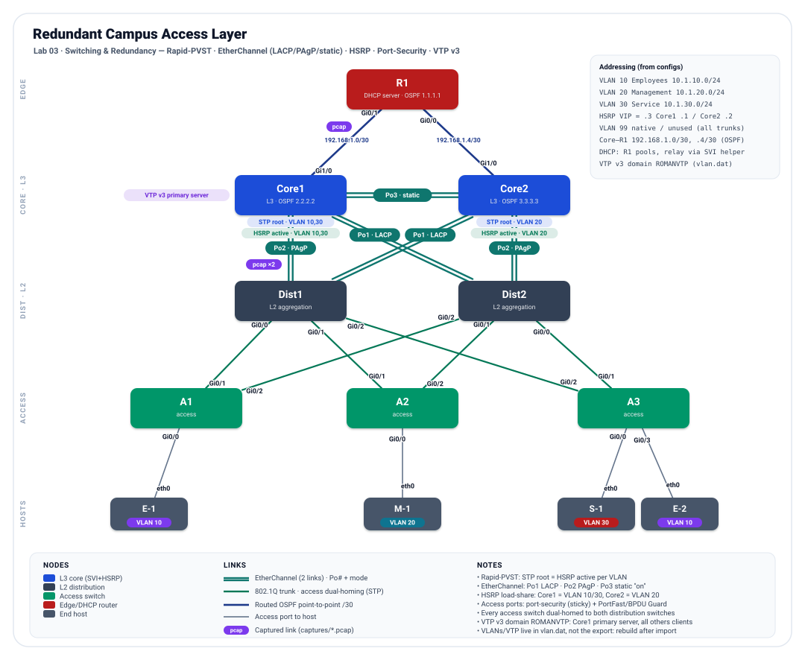

# Redundant Campus Access Layer — Dual-Homed L2/L3 Campus with HSRP, EtherChannel & Rapid-PVST


-005073)
-0b7285)


## Objective

This lab builds a **redundant, dual-homed campus** and proves it stays up when a link or a switch fails. Three access switches each home to **both** distribution switches; the distribution pair aggregates to a **redundant L3 core** where every VLAN's default gateway is an **HSRP** virtual IP, and every inter-switch connection is an **EtherChannel**. The design goal is that a host keeps its gateway, its uplink, and its path to the DHCP server through any single failure. It proves four Layer-2/redundancy competencies working together — Rapid-PVST with a deterministic, load-shared root; EtherChannel in all three negotiation modes; HSRP active/standby load-sharing; and access-port security — over an OSPF underlay with centralized DHCP.

## Topology

<p align="center">
  
</p>

*Line key: teal double line = EtherChannel bundle (2 physical links), labelled with its Port-channel and negotiation mode (Po1 LACP · Po2 PAgP · Po3 static "on") · green = 802.1Q trunk carrying the access-switch dual-homing (STP forwards one, blocks the other per VLAN) · navy = routed OSPF point-to-point /30 to the edge router · gray = access port to a host. Each non-bundled endpoint shows its interface; the cores carry STP-root and HSRP-active badges per VLAN; host VLAN membership is shown as a coloured chip.*

## Node Inventory

| Node | Role | Type | `node_definition` |
|------|------|------|-------------------|
| Core1 | L3 core — SVIs, HSRP active VLAN 10/30, STP root VLAN 10/30 (RID 2.2.2.2) | Multilayer switch | `iosvl2` |
| Core2 | L3 core — SVIs, HSRP active VLAN 20, STP root VLAN 20 (RID 3.3.3.3) | Multilayer switch | `iosvl2` |
| Dist1 | L2 distribution / aggregation (`no ip routing`) | Switch | `iosvl2` |
| Dist2 | L2 distribution / aggregation (`no ip routing`) | Switch | `iosvl2` |
| A1 | Access switch — VLAN 10 (Employees) | Switch | `iosvl2` |
| A2 | Access switch — VLAN 20 (Management) | Switch | `iosvl2` |
| A3 | Access switch — VLAN 30 (Service) + VLAN 10 (Employees) | Switch | `iosvl2` |
| R1 | Edge router — central DHCP server + OSPF (RID 1.1.1.1) | Router | `iosv` |
| E-1 | End host, VLAN 10 (Employees) — on A1 | Desktop | `desktop` |
| M-1 | End host, VLAN 20 (Management) — on A2 | Desktop | `desktop` |
| S-1 | End host, VLAN 30 (Service) — on A3 | Desktop | `desktop` |
| E-2 | End host, VLAN 10 (Employees) — on A3 | Desktop | `desktop` |

The two **Core** switches hold all Layer-3 (SVIs, HSRP, OSPF) and are the STP roots; the two **Dist** switches are pure Layer-2 aggregation (`no ip routing`). This is a routed-core model: the L3 boundary sits at the core, and Distribution is an L2 aggregation tier between access and core.

## Addressing & Segmentation

All values are read from the running-configs.

### VLANs

| VLAN | Name | Subnet | Gateway (HSRP VIP) | Host ports |
|------|------|--------|--------------------|------------|
| 10 | Employees | `10.1.10.0/24` | `10.1.10.3` | A1 Gi0/0 → E-1; A3 Gi0/3 → E-2 |
| 20 | Management | `10.1.20.0/24` | `10.1.20.3` | A2 Gi0/0 → M-1 |
| 30 | Service | `10.1.30.0/24` | `10.1.30.3` | A3 Gi0/0 → S-1 |
| 99 | native / unused | — | — | native VLAN on every trunk |

*CML exports drop the `vlan` name-definition stanzas, so the VLAN names are not in the file; the names above are from the lab's topology annotations, and `show vlan brief` on the switches confirms them. VLAN 99 is the unused native VLAN on all trunks (a VLAN-hopping hardening step); it carries no SVI and no host. VLAN 10 spans two access switches (A1 and A3), so it can be used to test intra-VLAN reachability across the switched core.*

### First-hop redundancy (HSRP)

Each VLAN has one virtual gateway (`.3`) shared by both cores; the active role is split per VLAN so both cores forward in steady state.

| VLAN | Group | VIP | Core1 (`.1`) | Core2 (`.2`) | Active |
|------|-------|-----|--------------|--------------|--------|
| 10 | 0 | `10.1.10.3` | priority 255, preempt | priority 1 | **Core1** |
| 20 | 1 | `10.1.20.3` | priority 1 | priority 255, preempt | **Core2** |
| 30 | 2 | `10.1.30.3` | priority 255, preempt | priority 1 | **Core1** |

### Spanning tree (Rapid-PVST)

Root priorities live on the cores and mirror the HSRP active role, so the L2 path leads to the live gateway. Distribution and access run default priority.

| VLAN | Root (priority 4096) | Secondary (priority 8192) |
|------|----------------------|----------------------------|
| 10, 30 | **Core1** | Core2 |
| 20 | **Core2** | Core1 |

### OSPF (process 1, area 0) and the routed edge

| Router | Router-ID | Interfaces (→ area 0) | Role |
|--------|-----------|------------------------|------|
| R1 | 1.1.1.1 | Gi0/1 `192.168.1.1`, Gi0/0 `192.168.1.5` | Central DHCP server; OSPF only |
| Core1 | 2.2.2.2 | Gi1/0 `192.168.1.2`; SVIs `10.1.10/20/30.1` | L3 core |
| Core2 | 3.3.3.3 | Gi1/0 `192.168.1.6`; SVIs `10.1.10/20/30.2` | L3 core |

| Subnet | Endpoints |
|--------|-----------|
| `192.168.1.0/30` | Core1 Gi1/0 `.2` ↔ R1 Gi0/1 `.1` (routed, `ip ospf network point-to-point`) |
| `192.168.1.4/30` | Core2 Gi1/0 `.6` ↔ R1 Gi0/0 `.5` (routed, point-to-point) |

Inter-VLAN routing happens on the cores' SVIs. R1 is reached only over the two /30s; it runs no other interface and originates no default route, so the lab is self-contained (no Internet egress) by design.

### DHCP (server = R1)

| Pool | Network | default-router | Excluded |
|------|---------|----------------|----------|
| `VLAN10` | `10.1.10.0/24` | `10.1.10.3` | `.1`–`.10` |
| `VLAN20` | `10.1.20.0/24` | `10.1.20.3` | `.1`–`.10` |
| `VLAN30` | `10.1.30.0/24` | `10.1.30.3` | `.1`–`.10` |

Each pool hands out the **HSRP VIP** as the default gateway, so a client survives a core failover. The core SVIs relay to R1 with `ip helper-address`: Core1 → `192.168.1.1`, Core2 → `192.168.1.5` (each core's directly-connected R1 interface).

## Cabling / Link Map

Every link from the `links` list, interfaces resolved from each node's interface table. The ten core/distribution links form five 2-member EtherChannels; the six access uplinks are individual trunks.

| Link | A-side | B-side | Purpose |
|------|--------|--------|---------|
| l17 | Core1 Gi1/0 | R1 Gi0/1 | Routed OSPF p2p `192.168.1.0/30` |
| l16 | Core2 Gi1/0 | R1 Gi0/0 | Routed OSPF p2p `192.168.1.4/30` |
| l12 | Core1 Gi0/1 | Core2 Gi0/1 | **Po3** core-to-core (static `on`) member |
| l13 | Core1 Gi0/2 | Core2 Gi0/2 | **Po3** core-to-core (static `on`) member |
| l10 | Core1 Gi0/0 | Dist1 Gi0/3 | **Po2** Core1↔Dist1 (PAgP) member |
| l21 | Core1 Gi1/2 | Dist1 Gi1/2 | **Po2** Core1↔Dist1 (PAgP) member |
| l11 | Core2 Gi0/0 | Dist2 Gi0/3 | **Po2** Core2↔Dist2 (PAgP) member |
| l20 | Core2 Gi1/2 | Dist2 Gi1/2 | **Po2** Core2↔Dist2 (PAgP) member |
| l14 | Core1 Gi0/3 | Dist2 Gi1/0 | **Po1** Core1↔Dist2 (LACP) member |
| l19 | Core1 Gi1/1 | Dist2 Gi1/1 | **Po1** Core1↔Dist2 (LACP) member |
| l15 | Core2 Gi0/3 | Dist1 Gi1/0 | **Po1** Core2↔Dist1 (LACP) member |
| l18 | Core2 Gi1/1 | Dist1 Gi1/1 | **Po1** Core2↔Dist1 (LACP) member |
| l5 | Dist1 Gi0/0 | A1 Gi0/1 | Access uplink trunk (A1 → Dist1) |
| l8 | Dist2 Gi0/2 | A1 Gi0/2 | Access uplink trunk (A1 → Dist2) |
| l6 | Dist1 Gi0/1 | A2 Gi0/1 | Access uplink trunk (A2 → Dist1) |
| l7 | Dist2 Gi0/1 | A2 Gi0/2 | Access uplink trunk (A2 → Dist2) |
| l9 | Dist1 Gi0/2 | A3 Gi0/2 | Access uplink trunk (A3 → Dist1) |
| l4 | Dist2 Gi0/0 | A3 Gi0/1 | Access uplink trunk (A3 → Dist2) |
| l0 | A1 Gi0/0 | E-1 eth0 | Access port, VLAN 10 (port-security, PortFast/BPDU Guard) |
| l3 | A2 Gi0/0 | M-1 eth0 | Access port, VLAN 20 (port-security, PortFast/BPDU Guard) |
| l1 | A3 Gi0/0 | S-1 eth0 | Access port, VLAN 30 (port-security, PortFast/BPDU Guard) |
| l2 | A3 Gi0/3 | E-2 eth0 | Access port, VLAN 10 (port-security, PortFast/BPDU Guard) |

## Design Details

**Full dual-homing.** Every access switch has two uplinks, one to each distribution switch (A1: Gi0/1→Dist1, Gi0/2→Dist2; A2: Gi0/1→Dist1, Gi0/2→Dist2; A3: Gi0/2→Dist1, Gi0/1→Dist2). Each distribution switch in turn bundles to **both** cores, and the cores are joined to each other, so there is no single link or single box whose loss isolates an access switch. The redundant Layer-2 paths this creates are exactly what the spanning-tree and EtherChannel design below is there to manage.

**Layer-3 core with per-VLAN SVIs and HSRP load-sharing.** Both cores own an SVI in every VLAN and share a virtual gateway per VLAN. Priorities split the active role so Core1 forwards VLAN 10/30 and Core2 forwards VLAN 20, with the other core preempt-ready as standby.

```text
! Core1
interface Vlan10
 ip address 10.1.10.1 255.255.255.0
 ip helper-address 192.168.1.1
 standby 0 ip 10.1.10.3
 standby 0 priority 255
 standby 0 preempt
interface Vlan20
 ip address 10.1.20.1 255.255.255.0
 standby 1 ip 10.1.20.3
 standby 1 priority 1
```

**Rapid-PVST with root election aligned to HSRP.** All switches run `rapid-pvst`. The root is pinned on the cores and matched to the HSRP active role per VLAN, so the forwarding tree leads straight to the live gateway instead of hair-pinning to a root on a different box. Roots are load-shared between the two cores.

```text
! Core1  (root + HSRP active for VLAN 10 and 30)
spanning-tree mode rapid-pvst
spanning-tree vlan 10,30 priority 4096
spanning-tree vlan 20    priority 8192
! Core2  (root + HSRP active for VLAN 20)
spanning-tree vlan 20    priority 4096
spanning-tree vlan 10,30 priority 8192
```

**EtherChannel across all three negotiation modes.** Every core/distribution connection is a two-link bundle, and the design deliberately exercises each way IOS forms a channel: **LACP** (open standard) on the core-to-far-distribution links, **PAgP** (Cisco) on the core-to-near-distribution links, and a static **`on`** channel between the two cores. Each bundle is an 802.1Q trunk, so a member link failure halves bandwidth without dropping the path or re-running STP.

```text
! Core1 Gi0/3 - LACP member of Po1 to Dist2
interface GigabitEthernet0/3
 channel-protocol lacp
 channel-group 1 mode active
! Core1 Gi0/0 - PAgP member of Po2 to Dist1
interface GigabitEthernet0/0
 channel-protocol pagp
 channel-group 2 mode desirable
! Core1 Gi0/1 - static member of Po3 to Core2
interface GigabitEthernet0/1
 channel-group 3 mode on
```

*The negotiated ends match: LACP `active`↔`passive`, PAgP `desirable`↔`auto`, static `on`↔`on`.*

**VLAN trunking and native-VLAN hardening.** All inter-switch links (physical trunks and Port-channels) are dot1q trunks pruned to `10,20,30,99`, with `switchport nonegotiate` and an unused **native VLAN 99** so untagged traffic never lands on VLAN 1.

```text
interface Port-channel1
 switchport trunk allowed vlan 10,20,30,99
 switchport trunk encapsulation dot1q
 switchport trunk native vlan 99
 switchport mode trunk
 switchport nonegotiate
```

**Access-port hardening.** Every host port is a single-VLAN access port with `port-security` (sticky MAC learning, `restrict` on violation), PortFast (fast host convergence), and BPDU Guard (err-disable if a switch is plugged in).

```text
interface GigabitEthernet0/0
 switchport access vlan 10
 switchport mode access
 switchport nonegotiate
 switchport port-security
 switchport port-security mac-address sticky
 switchport port-security violation restrict
 spanning-tree portfast edge
 spanning-tree bpduguard enable
```

**OSPF underlay and centralized DHCP.** The two cores peer to the edge router `R1` over routed `/30` links (OSPF network type `point-to-point`), advertising the VLAN subnets into area 0. `R1` is the single DHCP server for all three VLANs; each core SVI relays to it, and every pool hands out the **HSRP VIP** as the default gateway so leases survive a core failover.

```text
! Core2 - routed uplink + OSPF
interface GigabitEthernet1/0
 no switchport
 ip address 192.168.1.6 255.255.255.252
 ip ospf network point-to-point
router ospf 1
 router-id 3.3.3.3
 network 10.1.10.0 0.0.0.255 area 0
 network 192.168.1.4 0.0.0.3 area 0
! R1 - DHCP with VIP gateway
ip dhcp pool VLAN10
 network 10.1.10.0 255.255.255.0
 default-router 10.1.10.3
```

## How to Run & Verify

**Import.** In CML, *Import* → select `topology.yaml` → start all nodes. Give the switches a minute to elect roots and form channels before testing.

| Test (where) | Command | Expected result |
|--------------|---------|-----------------|
| EtherChannels bundled | Core1: `show etherchannel summary` | Po1/Po2/Po3 in use (`SU`); Po1 protocol LACP, Po2 PAgP, Po3 `-` (static); both members `P` |
| STP root per VLAN | Core1: `show spanning-tree vlan 10` | Core1 is root for VLAN 10 (and 30); Core2 root for VLAN 20 |
| STP blocks a redundant uplink | A1: `show spanning-tree vlan 10` | one uplink `Root FWD`, the other `Altn BLK` |
| HSRP active/standby split | Core1 / Core2: `show standby brief` | Core1 Active VLAN 10/30, Core2 Active VLAN 20; VIP `.3`; peer Standby |
| Host gateway = VIP | E-1: `ip a` / default route | address in `10.1.10.0/24`, gateway `10.1.10.3` |
| DHCP bindings | R1: `show ip dhcp binding` | one binding per host across the three pools |
| Trunks / native VLAN | A3: `show interfaces trunk` | uplinks trunking `10,20,30,99`, native VLAN 99 |
| Port-security active | A1: `show port-security` | Gi0/0 secured, sticky MAC learned, violation `Restrict` |
| Inter-VLAN routing | E-1 (v10) → ping M-1 (v20) | success via the core SVIs |
| Intra-VLAN across the core | E-1 (A1) → ping E-2 (A3), both VLAN 10 | success across the switched core |
| OSPF adjacencies | Core1: `show ip ospf neighbor` | FULL with R1 and with Core2 |
| Gateway failover | ping the VIP from a host, then shut the active core's SVI/uplink | brief loss, then HSRP standby takes over; ping resumes |
| Uplink failover | shut one access uplink | STP moves the blocked uplink to forwarding; traffic continues |

### Captured verification (CML)

The following was captured from the running lab.

**All three EtherChannel negotiation modes are bundled and forwarding.** Core1 runs an LACP bundle to Dist2, a PAgP bundle to Dist1, and a static channel to Core2; every member port shows `(P)` for bundled, and each channel is `SU` (in use, Layer 2). The blank protocol column on Po3 is the static `on` channel:

```text
Core1# show etherchannel summary
Number of channel-groups in use: 3
Number of aggregators:           3

Group  Port-channel  Protocol    Ports
------+-------------+-----------+-----------------------------------------------
1      Po1(SU)         LACP      Gi0/3(P)    Gi1/1(P)
2      Po2(SU)         PAgP      Gi0/0(P)    Gi1/2(P)
3      Po3(SU)          -        Gi0/1(P)    Gi0/2(P)
```

**Root bridges landed exactly where they were designed, load-shared across the cores.** Core1 is root for VLAN 10 and 30 (cost 0, no root port, because it *is* the root); VLAN 20 roots on Core2 and is reached over Po3. Priorities read as the configured value plus the VLAN ID, so `4096 + 10 = 4106`:

```text
Core1# show spanning-tree root

                                        Root    Hello Max Fwd
Vlan                   Root ID          Cost    Time  Age Dly  Root Port
---------------- -------------------- --------- ----- --- ---  ------------
VLAN0010          4106 5254.0011.0661         0    2   20  15
VLAN0020          4116 5254.009a.f611         3    2   20  15  Po3
VLAN0030          4126 5254.0011.0661         0    2   20  15
VLAN0099         32867 5254.0005.91ae         3    2   20  15  Po2
```

VLAN 99 is the visible exception and confirms a known gap: it was never given a priority, so it kept the default `32768 + 99 = 32867` and rooted by lowest MAC on a switch one EtherChannel hop away through Po2, rather than on a core. See *Possible Extensions*.

**HSRP active/standby is split between the cores.** Core1 is Active for VLAN 10 and 30, Core2 for VLAN 20, and each is the standby for the other, all sharing the `.3` virtual IP:

```text
Core1# show standby brief
Interface   Grp  Pri P State   Active          Standby         Virtual IP
Vl10        0    255 P Active  local           10.1.10.2       10.1.10.3
Vl20        1    1     Standby 10.1.20.2       local           10.1.20.3
Vl30        2    255 P Active  local           10.1.30.2       10.1.30.3

Core2# show standby brief
Interface   Grp  Pri P State   Active          Standby         Virtual IP
Vl10        0    1     Standby 10.1.10.1       local           10.1.10.3
Vl20        1    255 P Active  local           10.1.20.1       10.1.20.3
Vl30        2    1     Standby 10.1.30.1       local           10.1.30.3
```

**Port-security is live on the access edge.** A1's host port has learned its sticky MAC and is armed with the `Restrict` action, with no violations recorded:

```text
A1# show port-security
Secure Port  MaxSecureAddr  CurrentAddr  SecurityViolation  Security Action
                (Count)       (Count)          (Count)
---------------------------------------------------------------------------
      Gi0/0              1            1                  0         Restrict
```

**Gateway failover works, and the client never changes its configuration.** With a VLAN 10 host pinging the virtual IP, shutting Core1's `Vlan10` SVI moved the Active role to Core2 on the same `10.1.10.3` address:

```text
E-1:~$ ping 10.1.10.3
64 bytes from 10.1.10.3: seq=0 ttl=42 time=8.896 ms
...
--- 10.1.10.3 ping statistics ---
85 packets transmitted, 59 packets received, 30% packet loss

Core2# show standby brief
Interface   Grp  Pri P State   Active          Standby         Virtual IP
Vl10        0    1     Active  local           unknown         10.1.10.3
Vl20        1    255 P Active  local           10.1.20.1       10.1.20.3
Vl30        2    1     Standby 10.1.30.1       local           10.1.30.3
```

Core2 reports `Standby unknown` because Core1's SVI is down, and VLAN 30 stayed on Core1, confirming the test was scoped to a single VLAN. The recovery is real but slow: roughly 26 packets were lost, a longer outage than HSRP's default 10-second hold time implies. Tuning the hello/hold timers and adding interface tracking is the documented next step. See *Possible Extensions*.

## Skills Demonstrated

- Redundant campus design: every access switch dual-homed to a distribution pair that aggregates to a redundant L3 core, with no single point of failure in the path.
- First-hop redundancy: HSRP with a per-VLAN virtual gateway and active/standby **load-sharing** across the two cores, and DHCP handing out the VIP so hosts actually benefit from it.
- Rapid-PVST with deliberate **root-bridge election**, load-shared across the cores and **aligned to the HSRP active role** per VLAN.
- EtherChannel in all three negotiation modes — **LACP**, **PAgP**, and static **`on`** — with matched partner modes, every bundle a trunk.
- VLAN design: 802.1Q trunking pruned per link, `nonegotiate`, and native-VLAN-99 hardening.
- Access-port hardening: port-security (sticky, restrict) with PortFast and BPDU Guard.
- OSPF underlay over routed point-to-point links and centralized DHCP with cross-subnet relay.
- Iterative build discipline: the topology and config were tightened over several revisions — fixing the DHCP gateway to the VIP, enabling port-security, moving to Rapid-PVST, and aligning the STP root to the HSRP active gateway.

## Possible Extensions

- **Tune the native VLAN's root.** VLAN 99 has no explicit priority, and the capture above confirms it rooted by lowest MAC away from the cores rather than following the designed tree. Fold `99` into Core1's `priority 4096` line for a fully deterministic topology, even though nothing rides it.
- **Even out port-security limits.** A3 sets `maximum 2`; A1/A2 use the default of 1. Set an explicit `maximum` on every access port so the policy is uniform and intentional.
- **Cut HSRP failover time and add tracking.** The measured failover dropped roughly 26 packets, well beyond the 10-second default hold time, so a user would notice the outage. Lower the timers (`standby 0 timers 1 3`) and add interface or object tracking so the active core also steps down when it loses its path to R1, not only when the box itself fails. As configured, shutting a core's uplinks alone will not trigger failover, because it keeps its SVIs up and continues exchanging hellos over Po3.
- **Push the L3 boundary to distribution.** The gateways sit at the core today. Moving SVIs/HSRP (or a routed access model) down a tier would shrink the L2 domain — a natural "routed-access" follow-up.
- **Give R1 an exit.** R1 originates no default and has no upstream, so there is no Internet path. Add an `external_connector` and `default-information originate` for an egress story (and a link to the Security & Services lab).
- **Cosmetic:** the topology annotation labels the core-to-R1 links "PPP," but they are routed Ethernet `/30`s with OSPF network type `point-to-point`, not PPP encapsulation; and the `E-2` desktop still carries the default `inserthostname-here` node config.

## Files

| File | Description |
|------|-------------|
| `README.md` | This documentation. |
| `topology.svg` | Hand-built topology diagram (embedded above). |
| `topology.yaml` | Sanitized CML export — Cisco banner/EULA blocks stripped from all eight IOS devices; all real configuration preserved (12 nodes, 22 links, parse-verified). |

---

*Documentation derived entirely from the device running-configs in the CML export `Switching`. Cabling and interfaces come from the `links` list; VLANs, HSRP, STP, EtherChannel, OSPF and DHCP come from each node's configuration. Where the export omits data (VLAN name stanzas), it is called out rather than assumed.*
