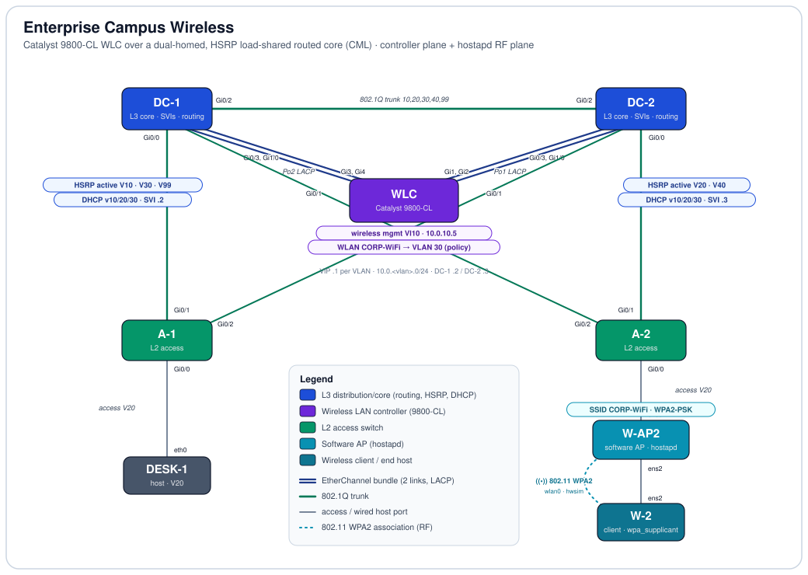

# Enterprise Campus Wireless — Catalyst 9800-CL over a Dual-Homed, HSRP-Routed Campus


-6d28d9)
-005073)


## Objective

This lab builds an **enterprise campus wireless design** on Cisco Modeling Labs: a Catalyst 9800-CL wireless LAN controller provisioned with a full **tag-based** configuration (WLAN, policy profile, and policy/site/RF tags), dual-homed into a redundant, routed distribution core where every VLAN's gateway is an **HSRP** virtual IP. It proves the controller-side skills a modern IOS-XE wireless deployment needs — WLAN security, VLAN-to-policy mapping, the tag model, and a resilient wired underlay of dual LACP EtherChannels and load-shared first-hop redundancy. Because CML ships no CAPWAP-capable virtual AP, the lab also demonstrates a **real 802.11 WPA2 association** out-of-band on Linux software radios (`hostapd` / `wpa_supplicant`), so the wireless story is shown end-to-end at the RF layer even though no access point can join the 9800. The design is documented as two deliberately separate planes: the **controller plane** (how an AP and client *would* be served in production) and the **RF plane** (what actually associates in the simulator).

## Topology

<p align="center">
  
</p>

*Line key: navy double line = LACP EtherChannel bundle (2 physical links), labelled with its Port-channel — the WLC's two uplinks, one bundle to each distribution switch · green = 802.1Q trunk (access-switch dual-homing and the inter-distribution link) · gray = access / wired host port · dashed cyan = the 802.11 WPA2 association between the software AP and the client (simulated `mac80211_hwsim` radios, not a cabled link). Each wired endpoint shows its interface; the distribution switches carry per-VLAN HSRP-active and DHCP badges; the WLC carries its wireless-management interface and the WLAN-to-VLAN policy mapping.*

## Node Inventory

| Node | Role | Type | `node_definition` |
|------|------|------|-------------------|
| DC-1 | L3 distribution/core — SVIs, `ip routing`, HSRP active VLAN 10/30/99, DHCP server | Multilayer switch | `iosvl2` |
| DC-2 | L3 distribution/core — SVIs, `ip routing`, HSRP active VLAN 20/40, DHCP server | Multilayer switch | `iosvl2` |
| WLC | Wireless LAN controller (tag-based); mgmt SVI Vlan10 `10.0.10.5` | Catalyst 9800-CL | `cat9800` |
| A-1 | Layer-2 access switch — dual-homed to DC-1 and DC-2 | Switch | `iosvl2` |
| A-2 | Layer-2 access switch — dual-homed to DC-1 and DC-2 | Switch | `iosvl2` |
| W-AP2 | Software access point — `hostapd` on a simulated radio (**not** controller-managed) | Ubuntu host | `wireless-ap` |
| W-2 | Wireless client — `wpa_supplicant` | Ubuntu host | `wireless-client` |
| DESK-1 | Wired end host, VLAN 20 (AP-MGMT), on A-1 | Desktop | `desktop` |

The two **DC** switches hold all Layer-3 (SVIs, HSRP, DHCP) and, with `ip routing` enabled, route between the VLAN subnets; the two **A** switches are pure Layer-2 access. The **WLC** is an appliance hanging off the distribution layer over two EtherChannels. **W-AP2** and **W-2** are Linux nodes that provide a genuine 802.11 association independent of the controller.

> **Export note on `ip routing`.** The CML config export supplied for this lab did not contain the `ip routing` line on DC-1/DC-2 (a known CML behaviour where the running change is not captured at export time). It has been confirmed enabled on the running lab and is present in the sanitized `topology.yaml` here so the file matches the running state; enable it explicitly (`configure terminal` → `ip routing`) if you rebuild from a fresh import.

## Addressing & Segmentation

All values are read from the device configs. Subnets follow `10.0.<vlan>.0/24`.

### VLANs

| VLAN | Name | Subnet | Gateway (HSRP VIP) | Purpose |
|------|------|--------|--------------------|---------|
| 10 | WLC-MGMT | `10.0.10.0/24` | `10.0.10.1` | Wireless management (WLC SVI `10.0.10.5`) |
| 20 | AP-MGMT | `10.0.20.0/24` | `10.0.20.1` | AP uplink + wired hosts (W-AP2 `ens3`, DESK-1) |
| 30 | WLAN-CORP | `10.0.30.0/24` | `10.0.30.1` | Corporate wireless client VLAN (WLAN policy target) |
| 40 | WLAN-GUEST | `10.0.40.0/24` | `10.0.40.1` | Guest wireless VLAN (SVIs + HSRP only; no WLAN bound yet) |
| 99 | INFRA-MGMT | `10.0.99.0/24` | `10.0.99.1` | Infrastructure management transit |

*Unusually for a CML export, the VLAN **names** above are not invented — they are carried in the 9800's `vlan` name stanzas (`vlan 10 name WLC-MGMT`, etc.). The IOSv-L2 switches' exports omit their own `vlan` name stanzas, as CML exports normally do. VLAN 40 has gateways and HSRP but no WLAN mapped to it yet; VLAN 30 is the only VLAN a WLAN policy currently targets.*

### First-hop redundancy (HSRP)

Each VLAN has one virtual gateway (`.1`) shared by both DCs; the active role is split per VLAN so both switches forward in steady state (DC-1 `.2`, DC-2 `.3`).

| VLAN | Group | VIP | DC-1 (`.2`) | DC-2 (`.3`) | Active |
|------|-------|-----|-------------|-------------|--------|
| 10 | 0 | `10.0.10.1` | priority 255, preempt | priority 1 | **DC-1** |
| 20 | 1 | `10.0.20.1` | priority 1 | priority 255, preempt | **DC-2** |
| 30 | 2 | `10.0.30.1` | priority 255, preempt | priority 1 | **DC-1** |
| 40 | 3 | `10.0.40.1` | priority 1 | priority 255, preempt | **DC-2** |
| 99 | 4 | `10.0.99.1` | priority 255, preempt | priority 1 | **DC-1** |

*DC-1 also carries a few inert leftover `standby 0`/`standby 1` groups on Vlan30/40/99 that have no virtual IP (an earlier group-numbering scheme); they hold no VIP and elect nothing. They are cosmetic and flagged under Possible Extensions.*

### DHCP (served by both DCs)

| Pool | Network | default-router | Excluded |
|------|---------|----------------|----------|
| `VLAN10` | `10.0.10.0/24` | `10.0.10.1` | `.1`–`.9` |
| `VLAN20` | `10.0.20.0/24` | `10.0.20.1` | `.1`–`.9` |
| `VLAN30` | `10.0.30.0/24` | `10.0.30.1` | `.1`–`.9` |

*Both DC-1 and DC-2 host the identical three pools and each hands out the **HSRP VIP** as the default-router, so a client keeps a usable gateway through a DC failover. There is no pool for VLAN 40 or VLAN 99. The two DCs run independent, un-coordinated DHCP servers on the same scopes — fine in the lab, but see Possible Extensions.*

### Wireless management

The controller's management plane lives on `Vlan10`: `interface Vlan10 → 10.0.10.5/24`, `wireless management interface Vlan10`, and a default route `ip route 0.0.0.0 0.0.0.0 10.0.10.1` toward the HSRP VIP.

## Cabling / Link Map

Every link from the `links` list, interfaces resolved from each node's interface table. The four WLC uplinks form two 2-member EtherChannels (one to each DC); the four access uplinks are individual trunks; the inter-DC link is a single trunk.

| Link | A-side | B-side | Mode / Purpose |
|------|--------|--------|----------------|
| l7 | WLC Gi1 | DC-2 Gi0/3 | **Po1** WLC↔DC-2 (LACP) member |
| l9 | WLC Gi2 | DC-2 Gi1/0 | **Po1** WLC↔DC-2 (LACP) member |
| l8 | WLC Gi3 | DC-1 Gi0/3 | **Po2** WLC↔DC-1 (LACP) member |
| l10 | WLC Gi4 | DC-1 Gi1/0 | **Po2** WLC↔DC-1 (LACP) member |
| l6 | DC-1 Gi0/2 | DC-2 Gi0/2 | Inter-distribution 802.1Q trunk (`10,20,30,40,99`) |
| l3 | A-1 Gi0/1 | DC-1 Gi0/0 | Access uplink trunk (A-1 → DC-1) |
| l5 | A-1 Gi0/2 | DC-2 Gi0/1 | Access uplink trunk (A-1 → DC-2) |
| l2 | A-2 Gi0/1 | DC-2 Gi0/0 | Access uplink trunk (A-2 → DC-2) |
| l4 | A-2 Gi0/2 | DC-1 Gi0/1 | Access uplink trunk (A-2 → DC-1) |
| l11 | A-1 Gi0/0 | DESK-1 eth0 | Access port, VLAN 20 (PortFast + BPDU Guard) |
| l1 | A-2 Gi0/0 | W-AP2 ens3 | Access port, VLAN 20 — AP uplink (PortFast + BPDU Guard) |
| l0 | W-AP2 ens2 | W-2 ens2 | Wired backhaul between the AP and client nodes |

*The 802.11 association W-2 → W-AP2 rides the nodes' `wlan0` simulated radios (`mac80211_hwsim`) and is therefore not a cabled entry in `links`; it is drawn as the dashed cyan link in the diagram.*

## Design Details

**Dual-homed three-tier with a routed distribution core.** Each access switch has two uplink trunks, one to each distribution switch (A-1: Gi0/1→DC-1, Gi0/2→DC-2; A-2: Gi0/1→DC-2, Gi0/2→DC-1), and the two DCs are joined by an inter-distribution trunk, so no single link or box isolates an access switch. The DCs own an SVI in every VLAN and, with `ip routing` enabled, route between the VLAN subnets; the access tier stays pure Layer 2.

```text
! DC-1 — routed core
ip routing
interface Vlan30
 ip address 10.0.30.2 255.255.255.0
 standby 2 ip 10.0.30.1
 standby 2 priority 255
 standby 2 preempt
```

**HSRP first-hop redundancy with per-VLAN load-sharing.** Both DCs share a virtual gateway (`.1`) in each VLAN, and the priorities split the active role so DC-1 forwards VLAN 10/30/99 and DC-2 forwards VLAN 20/40, each preempt-ready as standby for the other. DHCP hands the VIP to clients, so a lease survives a DC failover.

```text
! DC-2 — active for VLAN 20 and 40
interface Vlan20
 ip address 10.0.20.3 255.255.255.0
 standby 1 ip 10.0.20.1
 standby 1 priority 255
 standby 1 preempt
```

**Dual LACP EtherChannel WLC uplinks.** The 9800 aggregates its four ports into two 2-member Port-channels — Po1 (Gi1+Gi2) to DC-2 and Po2 (Gi3+Gi4) to DC-1 — rather than one bundle spanning both switches (which would require MLAG/VSS the platforms don't provide). Each bundle is an 802.1Q trunk. The WLC ends are LACP `passive`; the DC ends are LACP `active`, so the channels negotiate.

```text
! WLC — Po1 to DC-2 (two members)
interface GigabitEthernet1
 switchport trunk allowed vlan 10,20,30,40
 switchport mode trunk
 channel-protocol lacp
 channel-group 1 mode passive
! DC-2 — matching active end
interface GigabitEthernet0/3
 channel-protocol lacp
 channel-group 1 mode active
```

**802.1Q trunking and VLAN pruning.** All inter-switch links are dot1q trunks. The access-to-DC and inter-DC trunks carry `10,20,30,40,99`; the WLC uplinks are pruned to `10,20,30,40` (the controller does not need INFRA-MGMT). The IOSv-L2 switches set `switchport trunk encapsulation dot1q` (required on that platform); the 9800 is dot1q-only and takes no encapsulation command.

```text
! Access uplink (A-1 → DC-1)
interface GigabitEthernet0/1
 switchport trunk allowed vlan 10,20,30,40,99
 switchport trunk encapsulation dot1q
 switchport mode trunk
```

**Edge-port hardening.** The two access host ports (A-1 Gi0/0 to DESK-1, A-2 Gi0/0 to W-AP2) are single-VLAN access ports in VLAN 20 with PortFast and BPDU Guard, so a host converges immediately and the port err-disables if a switch is ever plugged in.

```text
interface GigabitEthernet0/0
 switchport access vlan 20
 switchport mode access
 spanning-tree portfast edge
 spanning-tree bpduguard enable
```

**Centralized DHCP.** Both DCs serve VLAN 10/20/30 with the VIP as default-router and `.1`–`.9` reserved. This is what a wired host on VLAN 20 (DESK-1, and W-AP2's uplink) leases from.

**WLC — the controller plane (tag-based).** The 9800 is configured the modern IOS-XE way: a WPA2-PSK WLAN, a policy profile that drops clients into VLAN 30, and the three tags that bind it all to an AP. `CORP-PTAG` maps the WLAN to the policy, `CORP-STAG` is the (local-mode) site tag, and `CORP-RTAG` is the RF tag; two APs are pre-provisioned by MAC with those tags, ready for a join.

```text
wlan CORP-WiFi 1 CORP-WiFi
 security wpa psk set-key ascii 0 ROMANISLEARNING
 no security wpa akm dot1x
 security wpa akm psk
 no shutdown
wireless profile policy CORP-POLICY
 vlan 30
 no shutdown
wireless tag policy CORP-PTAG
 wlan CORP-WiFi policy CORP-POLICY
wireless tag site CORP-STAG
wireless tag rf  CORP-RTAG
ap 5254.00eb.f7dc
 policy-tag CORP-PTAG
 rf-tag     CORP-RTAG
 site-tag   CORP-STAG
```

**Why no AP joins — and the RF plane that does work.** CML provides no CAPWAP-capable virtual access point, so nothing can register to the 9800; the controller config above is complete and correct but is never exercised by a real join, and the two pre-provisioned AP MACs stay unclaimed. To demonstrate a genuine 802.11 exchange, the lab runs an independent software AP: **W-AP2** launches `hostapd` on a simulated radio broadcasting the same SSID and PSK, and **W-2** associates to it with `wpa_supplicant`. This is a real WPA2/CCMP authentication and association at the RF layer — it just happens beside the controller, not under it. Matching the SSID and PSK is deliberate so the same client works against either path.

```text
# W-AP2 — hostapd.conf
interface=wlan0
ssid=CORP-WiFi
hw_mode=g          # 2.4 GHz
channel=6
wpa=2
wpa_key_mgmt=WPA-PSK
rsn_pairwise=CCMP
wpa_passphrase=ROMANISLEARNING

# W-2 — wpa_supplicant.conf
network={
    ssid="CORP-WiFi"
    key_mgmt=WPA-PSK
    psk="ROMANISLEARNING"
}
```

*`hostapd.conf` has no `bridge=` line, so the association is a pure 802.11 auth/assoc; the AP node's internal bridging between its radio, `ens2`, and its VLAN 20 uplink (`ens3`) is not part of the export, so how W-2's `ens2` DHCP request would reach the wired scope is not specified in the file. The verifiable wireless outcome here is the association itself.*

## How to Run & Verify

**Import.** In CML, *Import* → select `topology.yaml` → start all nodes. Give the switches a minute to form the EtherChannels and elect HSRP roles, and the Linux nodes a moment to run `cloud-init` before testing. Console into the 9800 over its **serial** console (the VGA/VNC console shows stale boot text).

| Test (where) | Command | Expected result |
|--------------|---------|-----------------|
| EtherChannels bundled | WLC: `show etherchannel summary` | Po1 and Po2 `(SU)`, protocol LACP, both members `(P)` |
| HSRP role split | DC-1 / DC-2: `show standby brief` | DC-1 Active V10/V30/V99, DC-2 Active V20/V40; VIP `.1`; peer Standby |
| Routing enabled | DC-1: `show ip route` | connected routes for all five `10.0.x.0/24`; inter-VLAN forwarding works |
| Trunks / pruning | A-1: `show interfaces trunk` | uplinks trunking `10,20,30,40,99`; WLC uplinks `10,20,30,40` |
| WLC mgmt reachable | WLC: `ping 10.0.10.1` | success (VIP on DC-1, same subnet) |
| DHCP leases | DC-1: `show ip dhcp binding` | bindings for wired VLAN 20 hosts |
| WLAN up | WLC: `show wlan summary` / `show wireless tag policy summary` | `CORP-WiFi` enabled; `CORP-PTAG` binds it to `CORP-POLICY` (VLAN 30) |
| AP join (expected empty) | WLC: `show ap summary` | **0 APs** — documents the CML CAPWAP limitation |
| hostapd AP up | W-AP2: `sudo iw dev wlan0 info` / `ps -ef \| grep hostapd` | `wlan0` type AP, SSID `CORP-WiFi`, `hostapd` running |
| Client association | W-2: `sudo iw dev wlan0 link` (`wpa_cli` needs `sudo`) | Connected to the AP's BSSID, SSID `CORP-WiFi` — a real WPA2 association |
| Client addressing | W-2: `ip addr show ens2` | **No IPv4** — the associated client gets no lease (see findings) |
| Failover | ping a VIP from a host, shut the active DC's SVI | brief loss, then the standby DC takes over the same `.1` |

### Captured verification (CML)

The following was captured from the running lab.

**Both WLC uplinks are bundled as LACP EtherChannels.** Po1 (Gi1+Gi2) to DC-2 and Po2 (Gi3+Gi4) to DC-1, every member `(P)`, each channel `SU` (in use, Layer 2):

```text
WLC# show etherchannel summary
Group  Port-channel  Protocol    Ports
1      Po1(SU)         LACP        Gi1(P)   Gi2(P)
2      Po2(SU)         LACP        Gi3(P)   Gi4(P)
```

**HSRP active/standby is split across the two DCs on the `.1` VIP.** DC-1 is Active for VLAN 10/30/99, DC-2 for VLAN 20/40, each the standby for the other — load-sharing exactly as designed:

```text
DC-1# show standby brief
Vl10  0  255 P Active   local       10.0.10.3   10.0.10.1
Vl20  1    1   Standby  10.0.20.3   local       10.0.20.1
Vl30  2  255 P Active   local       10.0.30.3   10.0.30.1
Vl40  3    1   Standby  10.0.40.3   local       10.0.40.1
Vl99  4  255 P Active   local       10.0.99.3   10.0.99.1
DC-2# show standby brief
Vl20  1  255 P Active   local       10.0.20.2   10.0.20.1
Vl40  3  255 P Active   local       10.0.40.2   10.0.40.1
```

**`ip routing` is live — the distribution core routes all five VLANs**, and the WLC reaches its gateway VIP:

```text
DC-1# show ip route   (connected routes)
C  10.0.10.0/24 is directly connected, Vlan10
C  10.0.20.0/24 is directly connected, Vlan20
C  10.0.30.0/24 is directly connected, Vlan30
C  10.0.40.0/24 is directly connected, Vlan40
C  10.0.99.0/24 is directly connected, Vlan99
WLC# ping 10.0.10.1   ->  Success rate is 100 percent (5/5)
```

**DHCP works — a VLAN 20 host leased from DC-2.** Both DCs serve the scope; DC-2 answered, so DC-1's binding table is empty (the two servers are uncoordinated):

```text
DC-2# show ip dhcp binding
IP address    Hardware address       Lease expiration       Type       State   Interface
10.0.20.10    0152.5400.0d63.c0      Sep 22 2026 06:26 PM   Automatic  Active  Vlan20
```

**Trunks carry the right VLANs, and STP is managing the redundant paths.** Access/inter-DC trunks allow `10,20,30,40,99`, the WLC bundle `10,20,30,40`; STP has blocked the inter-DC link (Gi0/2) for the data VLANs so there is no loop. The trunks sit on the default native VLAN 1 (unhardened — see Possible Extensions):

```text
DC-1# show interfaces trunk
Gi0/1  on  802.1q  trunking  1     allowed 10,20,30,40,99
Po2    on  802.1q  trunking  1     allowed 10,20,30,40
# Vlans in STP forwarding state and not pruned:  Gi0/2 (inter-DC) = none
```

**The 9800 has zero APs — the CML CAPWAP limitation, exactly as designed-around.** The controller config is complete but no AP can register:

```text
WLC# show ap summary
Number of APs: 0
```

**The RF plane is real and bidirectional.** `hostapd` on W-AP2 shows the client fully authorized/authenticated/associated at −31 dBm; W-2 confirms the same association to the AP's BSSID over SSID `CORP-WiFi`:

```text
W-AP2:~$ sudo iw dev wlan0 station dump
Station aa:a5:e5:00:00:00 (on wlan0)
        authorized: yes    authenticated: yes    associated: yes
        signal: -31 dBm    connected time: 3301 seconds
W-2:~$ sudo iw dev wlan0 link
Connected to aa:b7:01:00:00:00 (on wlan0)
        SSID: CORP-WiFi    signal: -31 dBm
```

**But the associated client gets no IP — the wireless data path stops at Layer 2.** W-2's `ens2` holds only a link-local address: nothing bridges the software AP's radio onto a VLAN, and there is no CAPWAP AP to place the client on VLAN 30, so it authenticates and associates but cannot lease an address or reach the wired network:

```text
W-2:~$ ip addr show ens2
2: ens2: <BROADCAST,MULTICAST,UP,LOWER_UP> ... state UP
    link/ether 52:54:00:55:26:8d
    inet6 fe80::5054:ff:fe55:268d/64 scope link      # no IPv4
```

**Finding — the honest ceiling of wireless in CML.** The wired campus (routing, HSRP load-sharing, dual LACP EtherChannels, DHCP) and the 9800's controller configuration are fully verified. The wireless association is genuine — a real 802.11 WPA2/CCMP auth+assoc, confirmed from both AP and client — but **end-to-end client connectivity is not achievable in CML**, because the platform provides no CAPWAP-capable AP and the `hostapd` software AP is not bridged onto a VLAN. Client association is demonstrable; client *reachability* to the wired network or another host is not. Closing that gap requires either a real/joinable AP registered to the 9800, or a bridged `hostapd` (both in Possible Extensions).

## Skills Demonstrated

- Modern IOS-XE wireless on the Catalyst 9800: **tag-based** configuration (WLAN → policy profile → policy/site/RF tags), WPA2-PSK WLAN security, VLAN-to-policy mapping, and the wireless management interface.
- Understanding controller architecture **and** platform limits: recognizing that CML has no CAPWAP AP, and working around it with a real `hostapd` / `wpa_supplicant` 802.11 WPA2 association instead of faking an end-to-end join.
- Redundant campus design: every access switch dual-homed to a routed distribution pair, an inter-distribution link, and no single point of failure in the wired path.
- First-hop redundancy: HSRP with a per-VLAN virtual gateway and active/standby **load-sharing** across the two DCs, with DHCP handing out the VIP.
- Link aggregation: **LACP EtherChannel**, correctly split into one bundle per distribution switch rather than an illegal cross-switch bundle, with matched passive/active ends.
- VLAN design and 802.1Q trunking with per-link pruning and platform-correct encapsulation (dot1q on IOSv-L2, dot1q-only on the 9800).
- Layer-2 edge hardening (PortFast + BPDU Guard) and centralized DHCP with VIP gateways.
- Linux networking: `cloud-init`-provisioned `hostapd` and `wpa_supplicant` over `mac80211_hwsim` simulated radios.

## Possible Extensions

- **Join a real AP.** The controller plane is complete but unexercised. Point a physical Cisco AP (or a lab platform that offers a CAPWAP-capable AP) at `10.0.10.5` in Flex/local mode to make the 9800 actually serve `CORP-WiFi` and land clients on VLAN 30.
- **Bridge the software-AP client onto VLAN 30.** Add `bridge=br0` to `hostapd.conf` and bridge `wlan0` to the VLAN 30 uplink so W-2 associates *and* leases an address from the corporate scope, closing the RF-to-wired gap.
- **Bind a guest WLAN to VLAN 40.** VLAN 40 (WLAN-GUEST) has gateways, HSRP, and a name but no WLAN or DHCP pool. Add a guest WLAN, a policy profile to VLAN 40, and a `VLAN40` DHCP pool for a second SSID.
- **Move to WPA2-Enterprise.** The WLAN is PSK-only (`no security wpa akm dot1x`). Add `dot1x`, a RADIUS server, and 802.1X to demonstrate enterprise authentication.
- **Add deterministic spanning tree.** The switches run PVST with no root priorities, so the root elects by lowest MAC (the captured `show interfaces trunk` shows STP has blocked the inter-DC link for the data VLANs — correct, but by default election, not design). Pin the root on the DCs and align it to the HSRP active role per VLAN (as in the switching-redundancy lab) for a predictable forwarding tree.
- **Harden the native VLAN.** The trunks sit on the default native VLAN 1 (`show interfaces trunk` → Native vlan 1). Set an unused native VLAN (e.g. 99) on every trunk, as the switching-fundamentals lab does, so untagged traffic never lands on VLAN 1.
- **Coordinate DHCP.** DC-1 and DC-2 run independent servers on the same scopes with no failover/sync; add DHCP failover or split the scopes to avoid duplicate offers.
- **Clean up HSRP.** Remove the inert leftover `standby 0`/`standby 1` groups on DC-1's Vlan30/40/99, and add interface/object tracking so a DC steps down when it loses its uplinks, not only when the box fails.
- **Rotate the lab PSK.** `ROMANISLEARNING` is a lab-only pre-shared key that appears in cleartext in three files; treat it as disposable and never reuse a real key in a public repo.

## Files

| File | Description |
|------|-------------|
| `README.md` | This documentation. |
| `topology.svg` | Hand-built topology diagram (embedded above). |
| `topology.yaml` | Sanitized CML export — Cisco banner/EULA blocks stripped from all four IOS switches; `ip routing` inserted on DC-1/DC-2 to match the confirmed running state; all other real configuration preserved (8 nodes, 12 links, parse-verified). |

---

*Documentation derived from the device configs in the CML export `Wireless`. Cabling and interfaces come from the `links` list; VLANs, HSRP, EtherChannel, DHCP, and the wireless configuration come from each node's config. Where the export omits data (the IOSv-L2 `vlan` name stanzas, the AP node's internal bridging) it is called out rather than assumed.*
