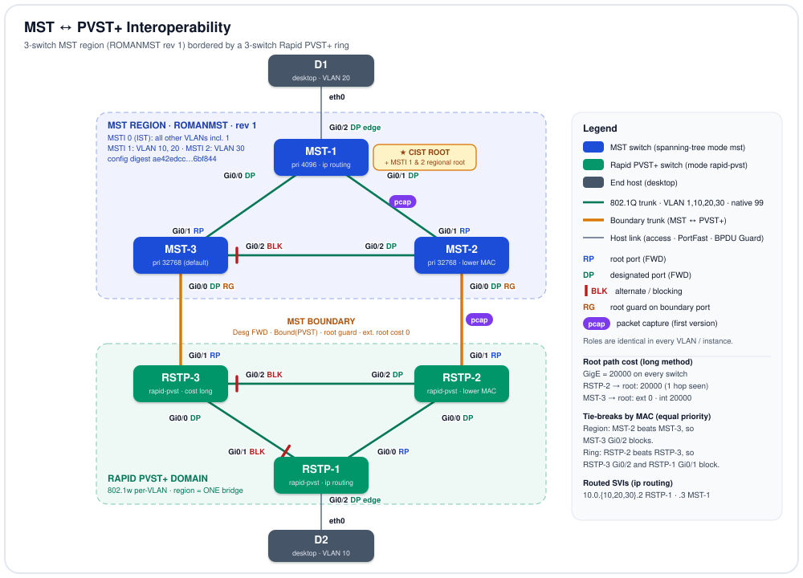

# MST ↔ PVST+ Interoperability — Three-Switch MST Region Bordered by a Rapid PVST+ Ring


-005073)
%20Region%20%2B%20Instances-1d4ed8)


## Objective

This lab builds a **Multiple Spanning Tree (MST) region** of three switches and connects it to a **Rapid PVST+** ring of three switches, then studies how the two protocols work together across the boundary while each still runs its own elections independently. The design goal is a single, loop-free Layer-2 domain whose root sits **inside** the region and is protected there by root guard, with VLANs mapped into two MST instances, path costs consistent on both sides, and hardened trunks and host ports. It proves that the PVST+ side treats the whole region as **one bridge**, which is confirmed with `show` output and with decoded BPDUs captured on a region link and on a boundary link.

## Topology

<p align="center">
  
</p>

*Line key: green = 802.1Q trunk carrying VLAN 1,10,20,30 with native VLAN 99 · orange = boundary trunk between the MST region and the Rapid PVST+ domain · gray = host access link. Every endpoint shows its interface and spanning-tree role (`RP` root, `DP` designated, red bar + `BLK` alternate/blocking, `RG` root guard, `edge` PortFast host port); the roles are the same in every VLAN and MST instance. Purple `pcap` tags mark the two links with packet captures in `captures/`.*

## Node Inventory

| Node | Role | Type | `node_definition` |
|------|------|------|-------------------|
| MST-1 | MST region switch · CIST root and regional root for MSTI 1 and 2 (priority 4096) · `ip routing`, SVIs `.3` | Multilayer switch | `iosvl2` |
| MST-2 | MST region switch · default priority, wins the region tie-break (lower MAC) · boundary to RSTP-2 (root guard) | Switch | `iosvl2` |
| MST-3 | MST region switch · default priority · boundary to RSTP-3 (root guard) · holds the region's blocked port | Switch | `iosvl2` |
| RSTP-1 | Rapid PVST+ switch · ring apex · `ip routing`, SVIs `.2` | Multilayer switch | `iosvl2` |
| RSTP-2 | Rapid PVST+ switch · uplink to MST-2 · wins the ring tie-break (lower MAC) | Switch | `iosvl2` |
| RSTP-3 | Rapid PVST+ switch · uplink to MST-3 | Switch | `iosvl2` |
| D1 | End host, VLAN 20, on MST-1 Gi0/2 | Desktop | `desktop` |
| D2 | End host, VLAN 10, on RSTP-1 Gi0/2 | Desktop | `desktop` |

The ring switches run `spanning-tree mode rapid-pvst`, matching their `RSTP-x` hostnames. The first version of this lab ran classic `pvst` on them; the packet captures in `captures/` come from that version (see *Captured verification*).

## Addressing & Segmentation

### VLANs and MST instance mapping

| VLAN | MST instance (region) | Subnet | SVIs | Hosts |
|------|-----------------------|--------|------|-------|
| 1 | MSTI 0 (IST / CIST) | — | none | — |
| 10 | MSTI 1 | `10.0.10.0/24` | RSTP-1 `10.0.10.2`, MST-1 `10.0.10.3` | D2 (RSTP-1 Gi0/2) |
| 20 | MSTI 1 | `10.0.20.0/24` | RSTP-1 `10.0.20.2`, MST-1 `10.0.20.3` | D1 (MST-1 Gi0/2) |
| 30 | MSTI 2 | `10.0.30.0/24` | RSTP-1 `10.0.30.2`, MST-1 `10.0.30.3` | — |
| 99 | MSTI 0 | — | none | native VLAN on every trunk; excluded from every allowed list except RSTP-3 Gi0/1's (which has none) |

*CML exports drop the `vlan` definition stanzas, so VLAN names are not in the file and none are assumed here; VLANs 10, 20 and 30 exist in the database (RSTP-2 runs a spanning-tree instance for each). The first-version capture showed a VTP domain of **`ROMAN`** in DTP frames; that state lives in `vlan.dat`, not the running-config, and DTP is now disabled. MST-1 and RSTP-1 run `ip routing`, so their SVIs route between VLAN 10, 20 and 30; that line is missing from the CML export (a known IOSv-L2 extraction quirk) and has been restored in `topology.yaml`. The two desktops carry no configuration in the export, so their addresses are not documented here.*

### MST region definition (identical on MST-1, MST-2, MST-3)

| Parameter | Value |
|-----------|-------|
| Region name | `ROMANMST` |
| Revision | `1` |
| Instance 1 | VLAN 10, 20 |
| Instance 2 | VLAN 30 |
| Instance 0 (IST) | all other VLANs, including VLAN 1 and 99 |
| Configuration digest | `ae42edcce65e40889987ff15ec6bf844` (from the BPDU capture; recomputed from the VLAN map and it matches) |

### Spanning-tree parameters

| Switch | Mode | Priority (config) | Path-cost method | Root port |
|--------|------|-------------------|------------------|-----------|
| MST-1 | `mst` | `mst 0-2 priority 4096` | long (MST default) | none (root) |
| MST-2 | `mst` | default 32768 | long | Gi0/1 → MST-1 |
| MST-3 | `mst` | default 32768 | long | Gi0/1 → MST-1 |
| RSTP-1 | `rapid-pvst` | default 32768 | `pathcost method long` | Gi0/0 → RSTP-2 |
| RSTP-2 | `rapid-pvst` | default 32768 | `pathcost method long` | Gi0/1 → MST-2 |
| RSTP-3 | `rapid-pvst` | default 32768 | `pathcost method long` | Gi0/1 → MST-3 |

### Port roles (same in every VLAN and every MST instance)

| Switch | Gi0/0 | Gi0/1 | Gi0/2 | Source |
|--------|-------|-------|-------|--------|
| MST-1 | Desg FWD → MST-3 | Desg FWD → MST-2 | Desg FWD (edge) → D1 | Root bridge: all ports designated |
| MST-2 | Desg FWD, Bound(PVST), root guard → RSTP-2 | Root FWD → MST-1 | Desg FWD → MST-3 | Gi0/0 and Gi0/1 captured; Gi0/2 is the far end of MST-3's blocked port |
| MST-3 | Desg FWD, Bound(PVST), root guard → RSTP-3 | Root FWD → MST-1 | **Altn BLK** → MST-2 | Gi0/0 and root port captured; Gi0/2 blocking confirmed in the running lab |
| RSTP-2 | Desg FWD → RSTP-1 | Root FWD → MST-2 | Desg FWD → RSTP-3 | Captured (all three ports) |
| RSTP-3 | Desg FWD → RSTP-1 | Root FWD → MST-3 | **Altn BLK** → RSTP-2 | Derived from RSTP-2's output |
| RSTP-1 | Root FWD → RSTP-2 | **Altn BLK** → RSTP-3 | Desg FWD (edge) → D2 | Derived from RSTP-2's output |

Three ports block in total: one inside the region (MST-3 Gi0/2) and two in the ring (RSTP-3 Gi0/2 and RSTP-1 Gi0/1). Both tie-breaks are decided by MAC address because the competing switches share a priority: MST-2 beats MST-3 inside the region, and RSTP-2 beats RSTP-3 in the ring.

## Cabling / Link Map

Every link from the `links` list, interfaces resolved from each node's interface table. All inter-switch ports are dot1q trunks with `switchport nonegotiate` and native VLAN 99.

| Link | A-side | B-side | Mode / Purpose |
|------|--------|--------|----------------|
| l4 | MST-3 Gi0/1 | MST-1 Gi0/0 | Region trunk (MST-3 root port) |
| l5 | MST-2 Gi0/1 | MST-1 Gi0/1 | Region trunk (MST-2 root port) · **captured** |
| l6 | MST-3 Gi0/2 | MST-2 Gi0/2 | Region trunk (MST-3 end blocks) |
| l2 | RSTP-3 Gi0/1 | MST-3 Gi0/0 | **Boundary** trunk, root guard on MST-3 (RSTP-3 end allows all VLANs; MST-3 allows 1,10,20,30) |
| l3 | RSTP-2 Gi0/1 | MST-2 Gi0/0 | **Boundary** trunk, root guard on MST-2 · **captured** |
| l9 | RSTP-3 Gi0/2 | RSTP-2 Gi0/2 | Ring trunk (RSTP-3 end blocks) |
| l1 | RSTP-1 Gi0/1 | RSTP-3 Gi0/0 | Ring trunk (RSTP-1 end blocks) |
| l0 | RSTP-1 Gi0/0 | RSTP-2 Gi0/0 | Ring trunk (RSTP-1 root port) |
| l8 | D1 eth0 | MST-1 Gi0/2 | Access port, VLAN 20 (PortFast edge, BPDU Guard) |
| l7 | D2 eth0 | RSTP-1 Gi0/2 | Access port, VLAN 10 (PortFast edge, BPDU Guard) |

## Design Details

### MST region: one name, one revision, one VLAN map

A group of MST switches only forms a single region when the name, the revision number and the VLAN-to-instance table all match, because neighbours compare an HMAC digest of that table rather than the table itself. All three MST switches carry the same block, mapping the user VLANs into two instances and leaving VLAN 1 and everything else in the IST.

```text
spanning-tree mode mst
spanning-tree mst configuration
 name ROMANMST
 revision 1
 instance 1 vlan 10, 20
 instance 2 vlan 30
```

The BPDU captured between MST-1 and MST-2 carries the configuration name `ROMANMST`, revision 1 and digest `ae42edcce65e40889987ff15ec6bf844`. Recomputing the 802.1s digest from the map above produces the same value, so the three switches are provably one region rather than three single-switch regions.

### Root placement and the region tie-break

MST-1 is pinned as root for the IST and both MSTIs with a single range command. MST-2 and MST-3 are deliberately left at the default priority.

```text
! MST-1
spanning-tree mst 0-2 priority 4096
```

Because MST-1 is the best bridge in the whole Layer-2 domain, it is at once the **CIST root** (the root the ring sees) and the **CIST regional root**, and it is also the regional root of MSTI 1 and MSTI 2. Inside the triangle both MST-3 and MST-2 have a 20000-cost root port straight to MST-1. On the MST-3 ↔ MST-2 link the two switches offer equal cost and equal priority, so the lower MAC address wins: MST-2 is designated and **MST-3 Gi0/2 blocks**.

The first version of this lab forced MST-2 to `mst 0-2 priority 61440`, which put the block on the other end of the same link (MST-2 Gi0/2, captured below). Removing that one line moved the blocked port across the link, which shows directly how bridge ID decides the designated port when costs are equal. All three instances share the same priorities, so they share this same tree; the instance split is in place and ready for load-sharing (see *Possible Extensions*).

### The boundary: the region looks like one switch

MST-3 Gi0/0 and MST-2 Gi0/0 face PVST+ switches, so they are **boundary ports** (`Bound(PVST)`). Toward the ring the region runs **PVST simulation**: it sends the CIST's information out for every VLAN, and every copy carries the same root, MST-1, with an **external root path cost of 0**. The ring switches therefore receive no information about hops inside the region. RSTP-2's cost to the root is only its own 20000 uplink even though the real path runs MST-2 → MST-1, and every VLAN on RSTP-2 reports the same root with no per-VLAN offset in the priority. Inside the region, the hop is tracked separately as **internal** root path cost, which is why MST-3 reports cost 0 for MST0 (external) but 20000 for MSTI 1 and 2.

### Root guard on the boundary

Both boundary ports carry root guard, so the CIST root cannot be pulled out of the region. If a ring switch ever advertised a better bridge ID than MST-1, the boundary port would move to a root-inconsistent blocking state instead of accepting the new root, and it recovers on its own once the superior BPDUs stop.

```text
! MST-2 Gi0/0 and MST-3 Gi0/0
interface GigabitEthernet0/0
 spanning-tree guard root
```

This enforces the design choice explained in *Why the root belongs inside the region*: the fragile "PVST+ root" scenario from the lab notes can no longer happen by accident.

### Rapid PVST+ and consistent path cost on the ring

The ring runs Rapid PVST+, so its ports converge with 802.1w proposal/agreement rather than 802.1D listening and learning timers. IOSv-L2 in PVST+ modes defaults to the short (16-bit) cost method, where a GigabitEthernet link costs 4, whereas MST always uses the long method (20000). The ring switches are explicitly moved to the long method so that one GigabitEthernet hop costs the same on both sides of the boundary.

```text
! RSTP-1, RSTP-2, RSTP-3
spanning-tree mode rapid-pvst
spanning-tree extend system-id
spanning-tree pathcost method long
```

### Loop breaking in the ring

From the ring's side the topology is three switches with two links up to one "bridge" (the region). RSTP-2 and RSTP-3 each take their region uplink as root port at cost 20000. RSTP-1 is two hops away either way (40000 via RSTP-2 or via RSTP-3), and the RSTP-3 ↔ RSTP-2 link joins two equal-cost bridges, so both ties fall to bridge ID. No ring priorities are configured, so the lower MAC address decides, and RSTP-2 wins. RSTP-2 is designated on both ring links; RSTP-3 blocks its Gi0/2 toward RSTP-2, and RSTP-1 takes Gi0/0 (toward RSTP-2) as its root port and blocks Gi0/1 (toward RSTP-3). The result is loop-free, but it is chosen by burned-in addresses rather than by configuration.

### Together and independent: the resulting forwarding tree

The two protocols cooperate on exactly one thing: a single CIST root, MST-1, which the ring accepts through the boundary. Everything else is decided separately on each side. The region picks its designated ports using internal cost and MST bridge IDs, and the ring picks its own using per-VLAN Rapid PVST+ bridge IDs, with neither able to see the other's internal choices. Put together, the forwarding tree is:

```text
            MST-1 (root)
           /      \
       MST-3      MST-2
         |          |
      RSTP-3      RSTP-2
                    |
                  RSTP-1
```

RSTP-3 ends up as a leaf under MST-3. Both of its ring links have a blocked end (its own Gi0/2 and RSTP-1's Gi0/1), so it reaches its ring neighbours through the region: RSTP-3 → MST-3 → MST-1 → MST-2 → RSTP-2, four hops to a switch one cable away. This is expected for this design rather than a fault, and it illustrates the point of the lab: each domain builds a correct loop-free tree on its own terms, and the path between them is only as good as those two independent sets of decisions. RSTP-3 is not isolated either. Gi0/2 is its alternate port, so if the MST-3 uplink fails, Rapid PVST+ promotes it to root port almost immediately and RSTP-3 reaches the root through RSTP-2.

### Why the root belongs inside the region

The accompanying notes also tried the reverse design, making a PVST+ switch the root, and found per-VLAN load balancing across the boundary to be close to impossible. That matches how the boundary works. The region exchanges only a single CIST with the outside, so every VLAN must enter and leave the region through the same boundary ports. When the CIST root sits on the PVST+ side, the region also elects a **master port** toward it, and the boundary accepts per-VLAN PVST+ BPDUs only while the root for every other VLAN is at least as good as the VLAN 1 root; any deviation puts the port into the *PVST Simulation Inconsistent* blocking state. Keeping the root inside the region, now enforced with root guard, avoids that fragile constraint, and it is the placement Cisco recommends for mixed MST and PVST+ networks.

### Trunk hardening

Every inter-switch trunk has DTP disabled with `switchport nonegotiate` and uses VLAN 99 as its native VLAN. VLAN 99 carries no SVI or host and is left out of the allowed lists, so no user VLAN rides untagged and a double-tagging (VLAN-hopping) attempt from a user VLAN cannot use the native VLAN. Trunks are pruned to `1,10,20,30`, with one exception: RSTP-3 Gi0/1 (the boundary uplink to MST-3) has no allowed list, while its MST-3 neighbour prunes to the four in use. CDP is disabled globally and per interface.

```text
interface GigabitEthernet0/0
 switchport trunk allowed vlan 1,10,20,30
 switchport trunk encapsulation dot1q
 switchport trunk native vlan 99
 switchport mode trunk
 switchport nonegotiate
```

### Host ports

Each desktop sits on a single-VLAN access port with PortFast (so the host link forwards immediately instead of waiting on spanning tree) and BPDU Guard (so the port err-disables if a switch is plugged in). D1 is in VLAN 20 on the MST side and D2 is in VLAN 10 on the ring side, so traffic between them has to be routed and has to cross the boundary.

```text
! MST-1 Gi0/2 (D1)                     ! RSTP-1 Gi0/2 (D2)
switchport access vlan 20              switchport access vlan 10
switchport mode access                 switchport mode access
spanning-tree portfast edge            spanning-tree portfast edge
spanning-tree bpduguard enable         spanning-tree bpduguard enable
```

*RSTP-1 Gi0/2 still carries `switchport trunk allowed vlan` and `switchport trunk encapsulation dot1q` from its earlier trunk configuration; they have no effect on an access port.*

### SVIs and inter-VLAN routing

RSTP-1 and MST-1 hold SVIs in VLAN 10, 20 and 30, one on each side of the boundary, and both run `ip routing`, so each can route between the three subnets. A ping between them in any VLAN proves Layer-2 forwarding through the boundary and through the region for both MST instances, and the SVIs are the gateways available to the hosts in VLAN 10 and 20.

```text
! RSTP-1                               ! MST-1
ip routing                             ip routing
interface Vlan10                       interface Vlan10
 ip address 10.0.10.2 255.255.255.0     ip address 10.0.10.3 255.255.255.0
```

*CML's IOSv-L2 export omits `ip routing` even when it is enabled (the same quirk seen in the Enterprise Campus Wireless lab). It is enabled on MST-1 and RSTP-1 in the running lab and has been restored on those two nodes in `topology.yaml`.*

## How to Run & Verify

**Import.** In CML, *Import* → select `topology.yaml` → start all nodes. Give the switches a minute to boot and converge. The desktops have no saved configuration, so give D1 an address in `10.0.20.0/24` and D2 an address in `10.0.10.0/24`, each with an SVI in its own VLAN as the default gateway.

| Test (where) | Command | Expected result |
|--------------|---------|-----------------|
| One region | MST-1/2/3: `show spanning-tree mst configuration` | Name `ROMANMST`, revision 1, instance 1 = VLAN 10,20, instance 2 = VLAN 30 on all three |
| Digest match | MST-1/2/3: `show spanning-tree mst configuration digest` | Same digest on all three (`AE42EDCC…6BF844`) |
| Root placement | MST-1: `show spanning-tree bridge` | MST0/1/2 bridge IDs at priority 4096 + instance; MST-1 is root for all |
| Internal vs external cost | MST-3: `show spanning-tree root detail` | MST0 cost 0 (external), MST1 and MST2 cost 20000, root port Gi0/1 |
| Region blocking | MST-3: `show spanning-tree interface gi0/2` | Altn BLK in MST0, MST1, MST2 (MST-2 Gi0/2 is Desg FWD) |
| Boundary ports | MST-2 / MST-3: `show spanning-tree interface gi0/0` | Desg FWD, `P2p Bound(PVST)` for MST0, MST1, MST2 |
| Root guard armed | MST-2 / MST-3: `show spanning-tree inconsistentports` | No inconsistent ports in normal operation |
| Region = one bridge | RSTP-2: `show spanning-tree root detail` | VLAN 1, 10, 20, 30 all rooted at MST-1's address, priority 4096, cost 20000, port Gi0/1 |
| Ring tie-break | RSTP-2: `show spanning-tree interface gi0/0`, `gi0/1`, `gi0/2` | Gi0/1 Root FWD; Gi0/0 and Gi0/2 Desg FWD in every VLAN |
| Ring blocked ports | RSTP-1 / RSTP-3: `show spanning-tree vlan 10` | RSTP-1: Gi0/0 Root FWD (cost 40000), Gi0/1 Altn BLK · RSTP-3: Gi0/1 Root FWD, Gi0/2 Altn BLK |
| Rapid mode and long cost | RSTP-x: `show spanning-tree summary` | `Switch is in rapid-pvst mode`, `Pathcost method used is long` |
| Trunk hardening | any switch: `show interfaces trunk` | Native VLAN 99, allowed `1,10,20,30`, mode `on` (no DTP) |
| Edge ports | MST-1 / RSTP-1: `show spanning-tree interface gi0/2 detail` | Port is in portfast edge mode, BPDU guard enabled |
| Forwarding across the boundary | RSTP-1: `ping 10.0.10.3`, `ping 10.0.20.3`, `ping 10.0.30.3` | Success for all three VLANs (MSTI 1 and MSTI 2 paths) |
| Inter-VLAN routing | MST-1 / RSTP-1: `show ip route connected` | Three connected /24s on each switch |
| End to end | D1 (VLAN 20) → ping D2 (VLAN 10) | Success, routed by the SVIs and carried across the boundary |
| BPDU inspection | Open `captures/*.pcap` in Wireshark | MSTP BPDUs inside the region; PVST simulation BPDUs on the boundary |

### Captured verification (CML)

The output below was captured from the running lab and is kept as recorded. The lab has two exported versions, and some captures predate the current one:

| Capture | Taken on | Matches the current config? |
|---------|----------|-----------------------------|
| MST-1 bridge IDs, MST-3 and RSTP-2 root detail, MST-3 Gi0/0 | MST-1 at priority 4096 | Yes |
| MST-2 Gi0/0, Gi0/1 and RSTP-2 port roles | First version | Yes: these roles did not change |
| MST-2 Gi0/2 (`Altn BLK`) | First version, MST-2 at 61440 | No: the block has since moved to MST-3 Gi0/2 |
| Both `.pcap` files | First version: MST-1 at 16384, MST-2 at 61440, ring on classic `pvst` | Mechanism yes; priorities and BPDU format no |

**MST-1 is the bridge for all three instances, with the instance number added to the priority:**

```text
MST-1# show spanning-tree bridge id
MST0     1000.5254.00e0.ce8f
MST1     1001.5254.00e0.ce8f
MST2     1002.5254.00e0.ce8f
```

**Inside the region, external and internal cost are tracked separately.** MST-3 reaches MST-1 over Gi0/1; the IST shows cost 0 because the root is in the region (no external cost), while the MSTIs count the 20000 internal hop:

```text
MST-3# show spanning-tree root detail
 MST0
  Root ID    Priority    4096
             Address     5254.00e0.ce8f
             Cost        0
             Port        2 (GigabitEthernet0/1)
 MST1
  Root ID    Priority    4097
             Address     5254.00e0.ce8f
             Cost        20000
             Port        2 (GigabitEthernet0/1)
 MST2
  Root ID    Priority    4098
             Address     5254.00e0.ce8f
             Cost        20000
             Port        2 (GigabitEthernet0/1)
```

**Both boundary ports are designated and forwarding, and identify the neighbour as PVST:**

```text
MST-2# show spanning-tree interface gig0/0
Mst Instance        Role Sts Cost      Prio.Nbr Type
------------------- ---- --- --------- -------- --------------------------------
MST0                Desg FWD 20000     128.1    P2p Bound(PVST)
MST1                Desg FWD 20000     128.1    P2p Bound(PVST)
MST2                Desg FWD 20000     128.1    P2p Bound(PVST)

MST-3# show spanning-tree interface gig0/0
Mst Instance        Role Sts Cost      Prio.Nbr Type
------------------- ---- --- --------- -------- --------------------------------
MST0                Desg FWD 20000     128.1    P2p Bound(PVST)
MST1                Desg FWD 20000     128.1    P2p Bound(PVST)
MST2                Desg FWD 20000     128.1    P2p Bound(PVST)
```

**MST-2's uplink is its root port, in every instance:**

```text
MST-2# show spanning-tree interface gig0/1
Mst Instance        Role Sts Cost      Prio.Nbr Type
------------------- ---- --- --------- -------- --------------------------------
MST0                Root FWD 20000     128.2    P2p
MST1                Root FWD 20000     128.2    P2p
MST2                Root FWD 20000     128.2    P2p
```

**Before: with MST-2 forced to priority 61440 (first version), MST-2 lost the region tie-break and its Gi0/2 blocked:**

```text
MST-2# show spanning-tree interface gig0/2
Mst Instance        Role Sts Cost      Prio.Nbr Type
------------------- ---- --- --------- -------- --------------------------------
MST0                Altn BLK 20000     128.3    P2p
MST1                Altn BLK 20000     128.3    P2p
MST2                Altn BLK 20000     128.3    P2p
```

With that priority removed, MST-2 and MST-3 tie at 32768 and MST-2 wins on MAC address, so the blocked port is now **MST-3 Gi0/2** and MST-2 Gi0/2 forwards as designated.

**The ring sees the region as a single bridge.** Every VLAN on RSTP-2 has the same root (MST-1's address), the same priority with no VLAN offset, and a cost equal to its own uplink alone:

```text
RSTP-2# show spanning-tree root detail
 VLAN0001
  Root ID    Priority    4096
             Address     5254.00e0.ce8f
             Cost        20000
             Port        2 (GigabitEthernet0/1)
 VLAN0010
  Root ID    Priority    4096
             Address     5254.00e0.ce8f
             Cost        20000
             Port        2 (GigabitEthernet0/1)
 VLAN0020
  Root ID    Priority    4096
             Address     5254.00e0.ce8f
             Cost        20000
             Port        2 (GigabitEthernet0/1)
 VLAN0030
  Root ID    Priority    4096
             Address     5254.00e0.ce8f
             Cost        20000
             Port        2 (GigabitEthernet0/1)
```

The true path is RSTP-2 → MST-2 → MST-1, two hops and 40000 in total, yet RSTP-2 reports 20000: the hop inside the region is invisible from outside.

**RSTP-2 wins the ring tie-break.** Apart from its root port toward the region, RSTP-2 is designated on both ring links, including the link to RSTP-3. Both switches sit at cost 20000, so this proves RSTP-2 has the lower bridge ID, which places the ring's two blocked ports on RSTP-3 Gi0/2 and RSTP-1 Gi0/1:

```text
RSTP-2# show spanning-tree interface gig0/0
Vlan                Role Sts Cost      Prio.Nbr Type
------------------- ---- --- --------- -------- --------------------------------
VLAN0001            Desg FWD 20000     128.1    P2p
VLAN0010            Desg FWD 20000     128.1    P2p
VLAN0020            Desg FWD 20000     128.1    P2p
VLAN0030            Desg FWD 20000     128.1    P2p

RSTP-2# show spanning-tree interface gig0/1
Vlan                Role Sts Cost      Prio.Nbr Type
------------------- ---- --- --------- -------- --------------------------------
VLAN0001            Root FWD 20000     128.2    P2p
VLAN0010            Root FWD 20000     128.2    P2p
VLAN0020            Root FWD 20000     128.2    P2p
VLAN0030            Root FWD 20000     128.2    P2p

RSTP-2# show spanning-tree interface gig0/2
Vlan                Role Sts Cost      Prio.Nbr Type
------------------- ---- --- --------- -------- --------------------------------
VLAN0001            Desg FWD 20000     128.3    P2p
VLAN0010            Desg FWD 20000     128.3    P2p
VLAN0020            Desg FWD 20000     128.3    P2p
VLAN0030            Desg FWD 20000     128.3    P2p
```

#### Packet captures (decoded, first version)

These were captured on the first version of the lab, when MST-1 was at priority 16384, MST-2 at 61440, and the ring ran classic `pvst` with DTP still enabled. The mechanism they show is unchanged; the priority values and the boundary BPDU format are not.

**Region link, MST-1 Gi0/1 → MST-2 Gi0/1** (`captures/mst1-mst2_region-link.pcap`). Only MST-1 transmits, every 2 seconds, as the designated port; MST-2's silence on this link is consistent with it being MST-2's root port. The BPDU is version 3 (MSTP) and carries the region identity plus one record per MSTI:

```text
MSTP BPDU  src 52:54:00:0e:ae:be  port 0x8002 (128.2 = Gi0/1)  role Designated, Learning+Forwarding, Agreement
  CIST root          16384 / 5254.00e0.ce8f   external cost 0
  CIST regional root 16384 / 5254.00e0.ce8f   internal cost 0   remaining hops 20
  MST config         name ROMANMST  revision 1  digest ae42edcce65e40889987ff15ec6bf844
  MSTI 1             regional root 16385 / 5254.00e0.ce8f  cost 0  Designated, Forwarding
  MSTI 2             regional root 16386 / 5254.00e0.ce8f  cost 0  Designated, Forwarding
DTP        both ends advertise VTP domain "ROMAN", 802.1Q
```

**Boundary link, MST-2 Gi0/0 → RSTP-2 Gi0/1** (`captures/rstp2-mst2_boundary-link.pcap`). MST-2 sends five BPDUs every 2 seconds, all with identical CIST content, and RSTP-2 sends none (it is receiving on its root port). All are version 0 (802.1D), because the neighbour then ran classic PVST+:

```text
802.1D  untagged  -> 01:80:c2:00:00:00   (IEEE / CST)
SSTP    untagged  -> 01:00:0c:cc:cc:cd   (PVST+ VLAN 1)
SSTP    VLAN 10   -> 01:00:0c:cc:cc:cd
SSTP    VLAN 20   -> 01:00:0c:cc:cc:cd
SSTP    VLAN 30   -> 01:00:0c:cc:cc:cd
  every copy:  root 16384 / 5254.00e0.ce8f   root path cost 0
               bridge 61440 / 5254.00a2.e872 (MST-2)   port 0x8001 (128.1 = Gi0/0)
```

This is PVST simulation on the wire: one CIST replicated per VLAN, with root path cost 0, which is exactly why RSTP-2 computes only 20000. The same capture also records MST-2's bridge MAC, `5254.00a2.e872`, the address that now wins the region tie-break against MST-3.

## Skills Demonstrated

- MST (802.1s) region design: matching name, revision and VLAN-to-instance map across switches, with VLANs grouped into two instances.
- Deterministic root election across all instances with a single `mst 0-2 priority` range, plus a controlled experiment showing how removing one priority moves the blocked port across a link.
- MST ↔ Rapid PVST+ interoperability: boundary ports, PVST simulation, and the CIST root kept inside the region and enforced with root guard.
- Understanding of external versus internal root path cost, and why the region appears as a single bridge to PVST+ neighbours.
- Path-cost consistency across protocols with `spanning-tree pathcost method long`.
- Reading and predicting port roles across both domains: every root, designated and blocked port accounted for, with MAC-based tie-breaks worked out from `show` output and captures.
- Layer-2 hardening: DTP disabled, unused native VLAN 99 on every trunk, access-only host ports with PortFast and BPDU Guard.
- Multilayer switching: `ip routing` with SVIs in three subnets on a switch on each side of the boundary, carrying routed host traffic across it.
- Packet-level protocol analysis: decoding MSTP, 802.1D, PVST+ SSTP and DTP frames from CML captures, and recomputing the MST configuration digest to prove region membership.
- Evaluating a non-recommended design (PVST+ root) and explaining why it undermines per-VLAN load balancing.

## Possible Extensions

- **Make the instances earn their keep.** MSTI 1 and MSTI 2 use the same priorities, so both block the same port (MST-3 Gi0/2). Moving MSTI 2's regional root to MST-3 (for example MST-1 `mst 0-1 priority 4096` plus `mst 2 priority 8192`, and MST-3 `mst 2 priority 4096`) would block a different region link for VLAN 30 than for VLAN 10/20, which is the load-sharing MST exists to provide.
- **Replace the MAC tie-breaks with priorities.** Both tie-breaks are currently decided by MAC address, on purpose in the region. In production, an explicit secondary priority (still worse than MST-1's 4096) on MST-2 and on RSTP-2 keeps the blocked ports where they were designed and survives a hardware swap.
- **HSRP or VRRP.** VLAN 10, 20 and 30 each have two routed SVIs (`.2` and `.3`) and no first-hop redundancy. HSRP or VRRP across MST-1 and RSTP-1 would give hosts a single virtual gateway that survives the loss of either switch.
- **Finish the trunk and port cleanup.** Give RSTP-3 Gi0/1 the same `allowed vlan 1,10,20,30` list as its MST-3 neighbour, and remove the leftover trunk commands on RSTP-1 Gi0/2.


## Files

| File | Description |
|------|-------------|
| `README.md` | This documentation. |
| `topology.svg` | Hand-built topology diagram (embedded above). |
| `topology.yaml` | Sanitized CML export (`MST`): Cisco banner/EULA blocks stripped from all six IOSv-L2 switches; `ip routing` restored on MST-1 and RSTP-1 (dropped by the export); all other configuration preserved (8 nodes, 10 links, parse-verified). |
| `captures/mst1-mst2_region-link.pcap` | BPDU/DTP capture on the MST-1 ↔ MST-2 region link (l5), first version. |
| `captures/rstp2-mst2_boundary-link.pcap` | BPDU/DTP capture on the RSTP-2 ↔ MST-2 boundary link (l3), first version. |

---

*Documentation derived from the device running-configs in the CML export `MST`, the two link captures, `show` output from the running lab, and the lab notes. Cabling and interfaces come from the `links` list; MST, Rapid PVST+, trunking, host-port and SVI details come from each node's configuration. Where the export omits data (VLAN name stanzas, VTP domain, desktop configuration), it is called out rather than assumed.*
