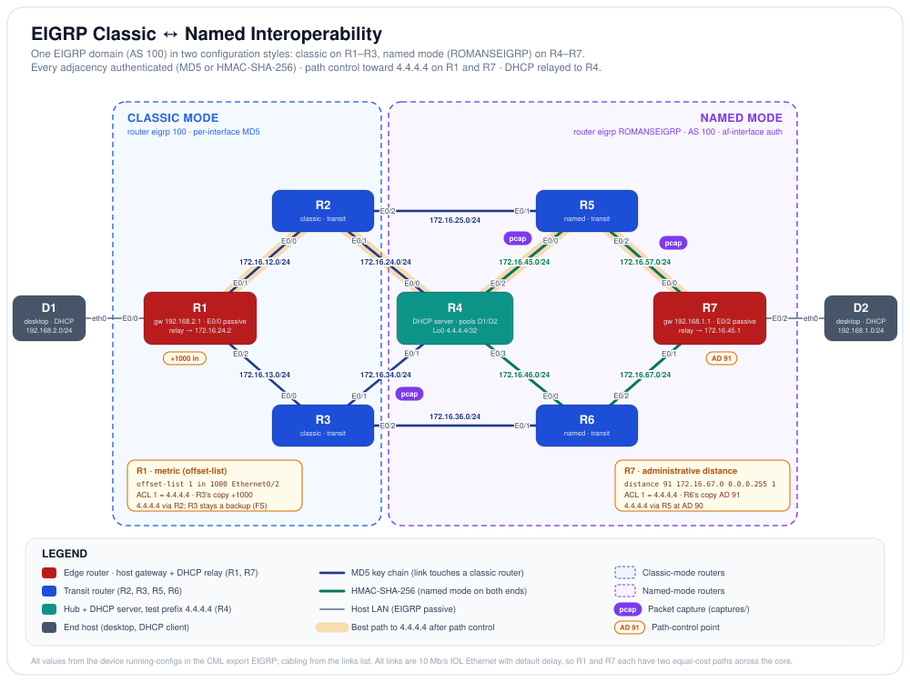
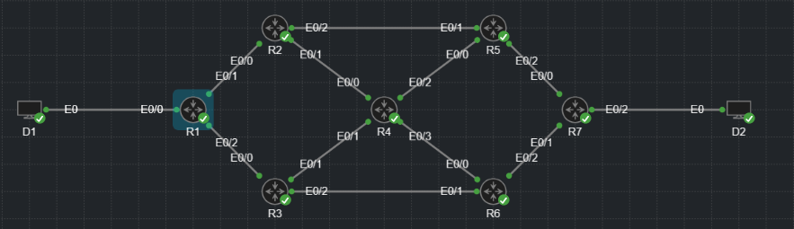

# EIGRP Classic ↔ Named Interoperability — Authenticated Dual-Mode EIGRP Core with Path Control & Centralized DHCP


-0b7285)


## Objective

This lab runs a single EIGRP domain (AS 100) across seven IOL-XE routers that are deliberately configured in **both EIGRP styles**: R1, R2 and R3 use classic `router eigrp 100`, while R4 through R7 use named mode (`router eigrp ROMANSEIGRP`, address family IPv4, AS 100). Every one of the ten router-to-router adjacencies is **authenticated**, with the method chosen by what each pair of routers supports: MD5 wherever a classic router is involved, HMAC-SHA-256 where both ends run named mode. On top of that core, the lab steers traffic to a test prefix (`4.4.4.4/32` on R4) with two different tools, a **metric offset** on R1 and a **per-neighbor administrative distance** on R7, and delivers **centralized DHCP** from R4 to both host LANs through relay. The design goals are full interoperability between the two configuration styles, authentication on every adjacency, deliberate and verifiable path selection, and hosts that lease addresses from a server several routed hops away. Each claim is backed by `show` output, `debug` output or a decoded packet capture.

## Topology

<p align="center">
  
</p>

*Line key: navy = EIGRP adjacency authenticated with an MD5 key chain (every link that touches a classic-mode router) · green = HMAC-SHA-256 (named mode on both ends) · gray = host LAN, EIGRP passive · amber halo = the path R1 and R7 use to reach `4.4.4.4` after path control. Each endpoint shows its interface and each routed link its subnet. The amber `+1000 in` and `AD 91` tags mark where the two path-control tools act, and the purple `pcap` tags mark the three links with packet captures in `captures/`.*

<p align="center">
  
</p>

*The same lab running in Cisco Modeling Labs, every node booted.*

## Node Inventory

| Node | Role | Type | `node_definition` |
|------|------|------|-------------------|
| R1 | Classic-mode edge router · D1's gateway `192.168.2.1` · DHCP relay · offset-list toward R3 | Router | `iol-xe` |
| R2 | Classic-mode transit router (upper path) | Router | `iol-xe` |
| R3 | Classic-mode transit router (lower path) | Router | `iol-xe` |
| R4 | Named-mode hub · central DHCP server · Loopback0 `4.4.4.4/32` (test prefix) | Router | `iol-xe` |
| R5 | Named-mode transit router (upper path) | Router | `iol-xe` |
| R6 | Named-mode transit router (lower path) | Router | `iol-xe` |
| R7 | Named-mode edge router · D2's gateway `192.168.1.1` · DHCP relay · per-neighbor distance toward R6 | Router | `iol-xe` |
| D1 | End host on `192.168.2.0/24` (DHCP client) | Desktop | `desktop` |
| D2 | End host on `192.168.1.0/24` (DHCP client) | Desktop | `desktop` |

## Addressing & Segmentation

### EIGRP (AS 100)

| Router | Configuration style | `network` statements | Passive | Path control |
|--------|---------------------|----------------------|---------|--------------|
| R1 | Classic, `router eigrp 100` | `172.16.0.0`, `192.168.2.0` | Ethernet0/0 (D1) | `offset-list 1 in 1000 Ethernet0/2` |
| R2 | Classic, `router eigrp 100` | `172.16.0.0` | none | none |
| R3 | Classic, `router eigrp 100` | `172.16.0.0` | none | none |
| R4 | Named, `ROMANSEIGRP` AF IPv4 AS 100 | `4.4.4.4 0.0.0.0`, `172.16.0.0` | none | none |
| R5 | Named, `ROMANSEIGRP` AF IPv4 AS 100 | `172.16.0.0` | none | none |
| R6 | Named, `ROMANSEIGRP` AF IPv4 AS 100 | `172.16.0.0` | none | none |
| R7 | Named, `ROMANSEIGRP` AF IPv4 AS 100 | `172.16.0.0`, `192.168.1.0` | Ethernet0/2 (D2) | `distance 91 172.16.67.0 0.0.0.255 1` |

*No `eigrp router-id` is configured anywhere, so each router chose its own ID when EIGRP started. R1 uses `192.168.2.1` and R4 uses `172.16.46.1` (both captured in R1's topology table), not R4's loopback: Loopback0 was added while EIGRP was already running, and EIGRP keeps its router ID until the process restarts. A fresh boot from this export would be expected to pick `4.4.4.4`, because loopback addresses are preferred. K-values, hello and hold timers are left at their defaults, which the captures confirm (K1 = K3 = 1, hold time 15 s). No interface has a `bandwidth` or `delay` statement, so every core link costs the same.*

### IP addressing

Each core link is a `/24` named after the two routers it joins, `172.16.XY.0`, and the lower-numbered router holds `.1`.

| Subnet | Link | `.1` | `.2` |
|--------|------|------|------|
| `172.16.12.0/24` | R1 ↔ R2 | R1 E0/1 | R2 E0/0 |
| `172.16.13.0/24` | R1 ↔ R3 | R1 E0/2 | R3 E0/0 |
| `172.16.24.0/24` | R2 ↔ R4 | R2 E0/1 | R4 E0/0 |
| `172.16.25.0/24` | R2 ↔ R5 | R2 E0/2 | R5 E0/1 |
| `172.16.34.0/24` | R3 ↔ R4 | R3 E0/1 | R4 E0/1 |
| `172.16.36.0/24` | R3 ↔ R6 | R3 E0/2 | R6 E0/1 |
| `172.16.45.0/24` | R4 ↔ R5 | R4 E0/2 | R5 E0/0 |
| `172.16.46.0/24` | R4 ↔ R6 | R4 E0/3 | R6 E0/0 |
| `172.16.57.0/24` | R5 ↔ R7 | R5 E0/2 | R7 E0/0 |
| `172.16.67.0/24` | R6 ↔ R7 | R6 E0/2 | R7 E0/1 |
| `192.168.2.0/24` | D1 LAN | R1 E0/0 (gateway) | D1 by DHCP |
| `192.168.1.0/24` | D2 LAN | R7 E0/2 (gateway) | D2 by DHCP |
| `4.4.4.4/32` | R4 Loopback0 | | |

*Ethernet0/3 is shut and uncabled on every router except R4, where it is the link to R6. The desktops carry no configuration in the export and take their addresses from DHCP.*

### Authentication (per link)

| Link | Ends | Method | Secret configured | Key ID on the wire |
|------|------|--------|-------------------|--------------------|
| R1 ↔ R2 | classic ↔ classic | MD5 | key chain `R1R2`, key 1 | |
| R1 ↔ R3 | classic ↔ classic | MD5 | key chain `R1R3`, key 1 | |
| R2 ↔ R4 | classic ↔ named | MD5 | key chain `R2R4`, key 1 | |
| R3 ↔ R4 | classic ↔ named | MD5 | key chain `R3R4`, key 1 | **1** (captured) |
| R2 ↔ R5 | classic ↔ named | MD5 | key chain `R2R5`, key 1 | |
| R3 ↔ R6 | classic ↔ named | MD5 | key chain `R3R6`, key 1 | |
| R4 ↔ R5 | named ↔ named | HMAC-SHA-256 | password `ROMANSSHA` **and** key chain `R4R5` | **1** (captured) |
| R4 ↔ R6 | named ↔ named | HMAC-SHA-256 | password `ROMANSSHA` **and** key chain `R4R6` | |
| R5 ↔ R7 | named ↔ named | HMAC-SHA-256 | password `ROMANSSHA` only | **0** (captured) |
| R6 ↔ R7 | named ↔ named | HMAC-SHA-256 | password `ROMANSSHA` only | |

*Every key chain holds a single `key 1` with the key string `ROMANSKEY`. These are lab-only secrets, published as part of the configuration.*

### DHCP (server = R4)

| Pool | Network | `default-router` | Excluded | Relayed by |
|------|---------|------------------|----------|------------|
| `D1` | `192.168.2.0/24` | `192.168.2.1` | `.1`–`.10` | R1 E0/0, `ip helper-address 172.16.24.2` (R4 E0/0) |
| `D2` | `192.168.1.0/24` | `192.168.1.1` | `.1`–`.10` | R7 E0/2, `ip helper-address 172.16.45.1` (R4 E0/2) |

## Cabling / Link Map

Every link from the `links` list, interfaces resolved from each node's interface table.

| Link | A-side | B-side | Subnet | Mode / Purpose |
|------|--------|--------|--------|----------------|
| l0 | D1 eth0 | R1 E0/0 | `192.168.2.0/24` | Host LAN, EIGRP passive |
| l1 | R1 E0/1 | R2 E0/0 | `172.16.12.0/24` | EIGRP, MD5 (classic ↔ classic) · best path to `4.4.4.4` from R1 |
| l2 | R1 E0/2 | R3 E0/0 | `172.16.13.0/24` | EIGRP, MD5 (classic ↔ classic) · inbound offset on R1 |
| l3 | R2 E0/1 | R4 E0/0 | `172.16.24.0/24` | EIGRP, MD5 (classic ↔ named) · R1's DHCP relay target |
| l4 | R3 E0/1 | R4 E0/1 | `172.16.34.0/24` | EIGRP, MD5 (classic ↔ named) · **captured** |
| l5 | R4 E0/2 | R5 E0/0 | `172.16.45.0/24` | EIGRP, HMAC-SHA-256 (named ↔ named) · R7's DHCP relay target · **captured** |
| l6 | R4 E0/3 | R6 E0/0 | `172.16.46.0/24` | EIGRP, HMAC-SHA-256 (named ↔ named) |
| l7 | R3 E0/2 | R6 E0/1 | `172.16.36.0/24` | EIGRP, MD5 (classic ↔ named) |
| l8 | R2 E0/2 | R5 E0/1 | `172.16.25.0/24` | EIGRP, MD5 (classic ↔ named) |
| l9 | R5 E0/2 | R7 E0/0 | `172.16.57.0/24` | EIGRP, HMAC-SHA-256 (named ↔ named) · best path to `4.4.4.4` from R7 · **captured** |
| l10 | R6 E0/2 | R7 E0/1 | `172.16.67.0/24` | EIGRP, HMAC-SHA-256 (named ↔ named) · AD 91 on R7 for `4.4.4.4` |
| l11 | D2 eth0 | R7 E0/2 | `192.168.1.0/24` | Host LAN, EIGRP passive |

## Design Details

### One autonomous system, two configuration styles

Classic mode configures EIGRP under `router eigrp <AS>` and puts per-interface settings such as authentication on the interfaces themselves. Named mode wraps everything in one hierarchy (`router eigrp <name>` → `address-family` → `af-interface` / `topology base`) and is the only mode that offers HMAC-SHA-256 and 64-bit wide metrics. The two interoperate because neighbors only have to agree on what goes on the wire: a common subnet, the AS number, the K-values and the authentication. R1 to R3 run classic and R4 to R7 run named, which creates four classic ↔ named adjacencies (R2–R4, R3–R4, R2–R5, R3–R6).

```text
! R1 (classic)
router eigrp 100
 network 172.16.0.0
 network 192.168.2.0
 passive-interface Ethernet0/0

! R4 (named)
router eigrp ROMANSEIGRP
 address-family ipv4 unicast autonomous-system 100
  topology base
  exit-af-topology
  network 4.4.4.4 0.0.0.0
  network 172.16.0.0
```

The R3 ↔ R4 capture shows how little the style matters on the wire. R3 (classic) and R4 (named) send **byte-identical** Hello payloads: the same parameters, the same software-version TLV (`28.0` / TLV `2.0`) and, because they share the key, the same MD5 digest. Only the IP header tells them apart.

### Authentication matched to what each pair supports

Classic mode only supports MD5, so every link with a classic router on either end uses an MD5 key chain, including the four links where a classic router meets a named one. HMAC-SHA-256 is used only where **both** ends run named mode. Each link has its own key chain, named after the two routers.

```text
! Key chain (one per link, same layout on both ends)
key chain R2R4
 key 1
  key-string ROMANSKEY

! R2 E0/1 (classic, MD5 toward named R4)
interface Ethernet0/1
 ip authentication mode eigrp 100 md5
 ip authentication key-chain eigrp 100 R2R4

! R4 E0/0 (named, MD5 toward classic R2)
  af-interface Ethernet0/0
   authentication mode md5
   authentication key-chain R2R4

! R4 E0/2 (named, SHA-256 toward R5: password and key chain)
  af-interface Ethernet0/2
   authentication mode hmac-sha-256 ROMANSSHA
   authentication key-chain R4R5

! R7 E0/0 (named, SHA-256 toward R5: password only)
  af-interface Ethernet0/0
   authentication mode hmac-sha-256 ROMANSSHA
```

The SHA-256 links use two configuration styles. R4–R5 and R4–R6 set both an inline password and a key chain, while R5–R7 and R6–R7 set the password only. The captures show which secret IOS uses: the password-only R5–R7 link sends **key ID 0**, while R4–R5, with both configured, sends **key ID 1**, the key chain's key. When both are present the key chain takes precedence, so the inline `ROMANSSHA` password on R4–R5 and R4–R6 is effectively unused.

The captures also show a practical difference between the two methods. On the R3–R4 MD5 link, both routers' Hellos carry the same digest, so the MD5 digest is not tied to the sender. On both SHA-256 links that were captured (R5–R7 and R4–R5), the two routers' Hello payloads are also byte-identical and use the same secret, yet the digests differ. With the payload and the secret identical, the difference has to come from outside the EIGRP payload, which is consistent with EIGRP's SHA-256 mode including the sender's IP address in the hash. A Hello captured from one router therefore cannot simply be replayed from a different address.

### An equal-cost core, and a hub that carries no transit

Every link is 10 Mb/s IOL Ethernet with the default delay, so cost is set purely by hop count. From R1, D2's LAN is three routers away along two equal paths, R1 → R2 → R5 → R7 and R1 → R3 → R6 → R7, and EIGRP installs both. R7 sees the same symmetry toward D1. R4 sits in the middle of the drawing, but the straight R2–R5 and R3–R6 links bypass it, so it is **not** on the best path between the two LANs. In normal operation it carries no traffic between D1 and D2, only traffic addressed to it, such as relayed DHCP and pings to its loopback. The captured traceroute from D1 to D2 confirms it: R1 → R3 → R6 → R7, with R4 never in the path.

Before any path control, R1 also had two equal paths to R4's loopback (captured below: metric `307232` via both R2 and R3, two hops each). That tie is what the two path-control tools break.

### Metric path control on R1 (offset-list)

An offset-list adds a fixed amount to the metric of matching routes as they are received on an interface. R1 adds 1000 to `4.4.4.4/32` when it arrives from R3 on Ethernet0/2, so R2's copy wins and R3's copy stays in the topology table as an alternative.

```text
! R1
ip access-list standard 1
 10 permit 4.4.4.4
router eigrp 100
 offset-list 1 in 1000 Ethernet0/2
```

The size of the offset matters. EIGRP only keeps a backup path as a **feasible successor** if the neighbor's reported distance is lower than the router's current feasible distance. R1's topology table (captured below) lists R2's path as `307232/281632` and R3's as `308232/282632`. The inbound offset is added to R3's reported distance as well as to R1's total, and IOS applies it as extra delay: R3's path shows 2,040 µs instead of 2,001 µs. R3's reported distance of 282,632 is still below R1's feasible distance of 307,232, so R3 stays a feasible successor that R1 can switch to without querying its neighbors. The first attempt used an offset of 10,000,000, which would have pushed R3's reported distance to 10,281,632 and left R1 with no backup (see *Problems found while building*).

### Administrative-distance path control on R7

R7 solves the same tie differently. Administrative distance does not change the metric; it ranks route sources, and the routing table installs the copy with the lowest distance. The `distance` command under `topology base` sets AD 91 for routes that match ACL 1 **and** were learned from a neighbor in `172.16.67.0/24`, which is only R6. R6's copy of `4.4.4.4` therefore drops out of the routing table and R5's copy is installed at the normal internal AD of 90.

```text
! R7
ip access-list standard 1
 10 permit 4.4.4.4
router eigrp ROMANSEIGRP
 address-family ipv4 unicast autonomous-system 100
  topology base
   distance 91 172.16.67.0 0.0.0.255 1
```

Because both tools are scoped by ACL 1 to the single test prefix, every other route keeps its two equal-cost paths.

### Classic and wide metrics side by side

R1 and R7 both reach `4.4.4.4` over two hops with the same bandwidth and delay, yet R1 reports metric **307,232** and R7 reports **1,536,640**. R1 uses the classic 32-bit formula. R7 runs named mode, which computes a 64-bit wide metric and scales it down by the default `metric rib-scale` of 128 to fit the routing table. Both numbers come from the same inputs, a minimum bandwidth of 10,000 kb/s and a total delay of 2,001.25 µs (IOS truncates the display to 2001):

```text
classic (R1):  256 × (10^7 / 10000 + 2001.25 / 10)     = 256 × 1200.125       =   307,232
wide (R7):     65536 × (10^7 / 10000 + 2001.25) / 128   = 512 × 3001.25        = 1,536,640
```

The wide formula counts delay in microseconds instead of tens of microseconds, so on this path delay is 200 of 1,200 units in the classic metric but 2,001 of 3,001 units in the wide metric. The two styles report metrics on different scales, which is one more reason to finish migrating a mixed domain to named mode.

### Centralized DHCP over relay

R4 is the only DHCP server. R1 and R7 relay their LAN's broadcasts to one of R4's interface addresses with `ip helper-address`, setting the relay agent address (`giaddr`) to their own LAN interface. R4 selects the pool whose network contains that address, so pool `D1` answers R1's relays and pool `D2` answers R7's. Each pool excludes `.1` to `.10` and hands out its own LAN's gateway. R4's binding table (captured below) records each lease against the interface the relayed request arrived on: Ethernet0/0 for D1, the address R1 relays to, and Ethernet0/2 for D2, the address R7 relays to.

```text
! R4
ip dhcp excluded-address 192.168.2.1 192.168.2.10
ip dhcp pool D1
 network 192.168.2.0 255.255.255.0
 default-router 192.168.2.1

! R1 E0/0
interface Ethernet0/0
 ip address 192.168.2.1 255.255.255.0
 ip helper-address 172.16.24.2
```

The replies are unicast back to the relay agent address, so R4 needs routes to both LANs, which R1 and R7 advertise with `network 192.168.2.0` and `network 192.168.1.0`.

### Passive host interfaces

Both host LANs are advertised into EIGRP, but neither edge router sends Hellos toward the desktops, so a device plugged into a host port cannot form an adjacency. The two styles express this differently:

```text
! R1 (classic)                          ! R7 (named)
router eigrp 100                        af-interface Ethernet0/2
 passive-interface Ethernet0/0           passive-interface
```

### Problems found while building

The lab went through three exports, and each round fixed something that was configured but did not do what was intended.

- **Crossed DHCP pools.** In the first export the pool for `192.168.1.0/24` handed out gateway `192.168.2.1` and the pool for `192.168.2.0/24` handed out `192.168.1.1`. Each pool had the right gateway for the host it was named after, but D1 actually sits on `192.168.2.0/24` and D2 on `192.168.1.0/24`. Because R4 picks a pool by the relay address, not by its name, each desktop received an address on its own subnet with a gateway on the other one, and could not reach anything beyond its own router. Swapping the `network` statements fixed it, and the pool names now match the hosts.
- **A subnet mask where a wildcard belonged.** On R7 the first ACL for the path-control tests was entered as `access-list 1 permit 4.4.4.4 255.255.255.255`. Standard ACLs take a wildcard mask, and a wildcard of all ones means "match any address", so IOS stored it as `permit any`; R1's ACL 1 was also stored as `permit any`. R1's offset therefore applied to **every** route learned from R3, which removed R1's equal-cost paths to D2's LAN as well. Re-entering the ACL on both routers as `permit 4.4.4.4 0.0.0.0` (stored as `permit 4.4.4.4`) scoped it to the test prefix.
- **An oversized offset.** The first offset was 10,000,000. It broke the tie, but because the offset is also added to R3's reported distance (confirmed in R1's topology table), it would have raised that distance to 10,281,632, far above R1's feasible distance, so R3 could not have been a feasible successor. It is now 1000.
- **A distance that matched both neighbors.** R7's first attempt was `distance 91 172.16.67.1 0.0.255.255 1`. With that wildcard the source matches `172.16.0.0/16`, which covers both R5 and R6, so every copy of the route got AD 91 and nothing changed (captured below). Narrowing it to `172.16.67.0 0.0.0.255` matches only R6.
- **Authentication rolled out one side at a time.** While MD5 was being added, R1 had it on Ethernet0/1 before R2 did. The `debug` output below shows R1 dropping R2's unauthenticated Hellos. That is how a one-sided change takes an adjacency down.

## How to Run & Verify

**Import.** In CML, *Import* → select `topology.yaml` → start all nodes. Give the routers a minute to boot and form adjacencies. D1 and D2 have no saved configuration and lease their addresses from R4 through the relays.

| Test (where) | Command | Expected result |
|--------------|---------|-----------------|
| Adjacencies (classic) | R1: `show ip eigrp neighbors` | Two neighbors: `172.16.12.2` (E0/1) and `172.16.13.2` (E0/2) |
| Adjacencies (named) | R4: `show eigrp address-family ipv4 neighbors` | Four neighbors: R2, R3, R5, R6 (ten adjacencies across the lab) |
| Mixed styles | R1 and R4: `show running-config \| section router eigrp` | `router eigrp 100` on R1; `router eigrp ROMANSEIGRP`, AS 100 on R4 |
| Authentication | R2: `show ip eigrp interfaces detail Ethernet0/1` · R4: `show eigrp address-family ipv4 interfaces detail` | MD5 with key chain `R2R4` on R2; MD5 on E0/0 and E0/1, HMAC-SHA-256 on E0/2 and E0/3 on R4 |
| Key chains | any router: `show key chain` | One chain per link, each with key 1 |
| Authentication failure | R1: `debug eigrp packets`, then remove the MD5 lines from R2 E0/0 | R1 logs `ignored packet from 172.16.12.2 ... (missing authentication)` and drops R2 when the 15 s hold time expires |
| Passive host ports | R1 / R7: `show ip protocols` | R1 lists `Ethernet0/0` as passive; R7 lists `Ethernet0/2` |
| Equal-cost core | R1: `show ip route 192.168.1.0` · R7: `show ip route 192.168.2.0` | Two paths each, at AD 90 (via R2 and R3 on R1; via R5 and R6 on R7) |
| Offset-list | R1: `show ip route 4.4.4.4` | One path, via `172.16.12.2` (R2), metric 307232 |
| Feasible successor | R1: `show ip eigrp topology 4.4.4.4/32` | R2 successor at `307232/281632`; R3 listed second at `308232/282632`, a feasible successor |
| Per-neighbor AD | R7: `show ip route 4.4.4.4` | One path, via `172.16.57.1` (R5), distance 90, metric 1536640 |
| DHCP | R4: `show ip dhcp binding` · D1 / D2: `ip a` | One binding per desktop: D1 `192.168.2.11` (via E0/0), D2 `192.168.1.11` (via E0/2) |
| End to end | D1: `ping` and `traceroute` to D2 | Success; path R1 → R2 or R3 → R5 or R6 → R7 → D2, never through R4 |
| Packet inspection | Open `captures/*.pcap` in Wireshark | MD5 TLV with key ID 1 on R3–R4; HMAC-SHA-256 TLV with key ID 0 on R5–R7 and key ID 1 on R4–R5 |

### Captured verification (CML)

The output below was captured from the running lab and is kept as recorded (configuration-mode prompts shortened to `R1#` / `R7#`). The captures span the build, so this table shows which configuration each one reflects:

| Capture | Taken on | Matches the current config? |
|---------|----------|-----------------------------|
| R1 `show ip route 4.4.4.4`, before path control | After R4's loopback was added, before any offset | Yes, as the baseline |
| R7 `show ip route 4.4.4.4`, first attempt | Distance matching `172.16.0.0/16`, ACL `permit any` | No: corrected in the final export |
| R1 and R7 `show ip route 4.4.4.4`, final | Final export | Yes |
| R1 and R4 neighbor tables, R1 topology entry, D1 traceroute, R4 DHCP bindings, D1 `ip a` | Final export | Yes |
| R1 `debug` output | During the initial build, MD5 half deployed | No: shows the failure mode |
| All three `.pcap` files | Final export | Yes |

**Both styles peer with each other.** Classic R1 sees both of its classic neighbors. Named R4 sees all four of its neighbors, classic R2 (`172.16.24.1`) and R3 (`172.16.34.1`) as well as named R5 and R6, every one of them authenticated and up for about an hour:

```text
R1# show ip eigrp neighbors
EIGRP-IPv4 Neighbors for AS(100)
H   Address                 Interface              Hold Uptime   SRTT   RTO  Q  Seq
                                                   (sec)         (ms)       Cnt Num
1   172.16.13.2             Et0/2                    14 01:01:01    1   100  0  81
0   172.16.12.2             Et0/1                    14 01:01:03    1   100  0  83

R4# show eigrp address-family ipv4 neighbors
EIGRP-IPv4 VR(ROMANSEIGRP) Address-Family Neighbors for AS(100)
H   Address                 Interface              Hold Uptime   SRTT   RTO  Q  Seq
                                                   (sec)         (ms)       Cnt Num
3   172.16.24.1             Et0/0                    11 01:01:15    1   100  0  82
2   172.16.46.2             Et0/3                    12 01:01:15   21   126  0  82
1   172.16.34.1             Et0/1                    13 01:01:16    1   100  0  80
0   172.16.45.2             Et0/2                    10 01:01:17    1   100  0  85
```

**Before path control, R1 has two equal-cost paths to R4's loopback**, one through each classic neighbor, two hops each:

```text
R1# show ip route 4.4.4.4
Routing entry for 4.4.4.4/32
  Known via "eigrp 100", distance 90, metric 307232, precedence routine (0), type internal
  Redistributing via eigrp 100
  Last update from 172.16.13.2 on Ethernet0/2, 00:02:32 ago
  Routing Descriptor Blocks:
    172.16.13.2, from 172.16.13.2, 00:02:32 ago, via Ethernet0/2
      Route metric is 307232, traffic share count is 1
      Total delay is 2001 microseconds, minimum bandwidth is 10000 Kbit
      Reliability 255/255, minimum MTU 1500 bytes
      Loading 1/255, Hops 2
  * 172.16.12.2, from 172.16.12.2, 00:02:32 ago, via Ethernet0/1
      Route metric is 307232, traffic share count is 1
      Total delay is 2001 microseconds, minimum bandwidth is 10000 Kbit
      Reliability 255/255, minimum MTU 1500 bytes
      Loading 1/255, Hops 2
```

**After `offset-list 1 in 1000 Ethernet0/2` with ACL 1 = `4.4.4.4`, only the path through R2 is installed.** The metric is unchanged because the offset only applies to R3's copy:

```text
R1# show ip route 4.4.4.4
Routing entry for 4.4.4.4/32
  Known via "eigrp 100", distance 90, metric 307232, precedence routine (0), type internal
  Redistributing via eigrp 100
  Last update from 172.16.12.2 on Ethernet0/1, 00:00:00 ago
  Routing Descriptor Blocks:
  * 172.16.12.2, from 172.16.12.2, 00:00:00 ago, via Ethernet0/1
      Route metric is 307232, traffic share count is 1
      Total delay is 2001 microseconds, minimum bandwidth is 10000 Kbit
      Reliability 255/255, minimum MTU 1500 bytes
      Loading 1/255, Hops 2
```

**R3 is kept as a feasible successor.** R1's topology table still holds R3's copy. Its reported distance, 282,632, is R3's own distance (281,632) plus the 1000 offset, and it is below R1's feasible distance of 307,232. The offset appears as 39 µs of extra delay (2040 instead of 2001). The table also shows R1's router ID (`192.168.2.1`) and that `4.4.4.4` originates from R4's router ID, `172.16.46.1`:

```text
R1# show ip eigrp topology 4.4.4.4/32
EIGRP-IPv4 Topology Entry for AS(100)/ID(192.168.2.1) for 4.4.4.4/32
  State is Passive, Query origin flag is 1, 1 Successor(s), FD is 307232
  Descriptor Blocks:
  172.16.12.2 (Ethernet0/1), from 172.16.12.2, Send flag is 0x0
      Composite metric is (307232/281632), route is Internal
      Vector metric:
        Minimum bandwidth is 10000 Kbit
        Total delay is 2001 microseconds
        Reliability is 255/255
        Load is 1/255
        Minimum MTU is 1500
        Hop count is 2
        Originating router is 172.16.46.1
  172.16.13.2 (Ethernet0/2), from 172.16.13.2, Send flag is 0x0
      Composite metric is (308232/282632), route is Internal
      Vector metric:
        Minimum bandwidth is 10000 Kbit
        Total delay is 2040 microseconds
        Reliability is 255/255
        Load is 1/255
        Minimum MTU is 1500
        Hop count is 2
        Originating router is 172.16.46.1
```

**First attempt on R7: the distance matched both neighbors.** With `distance 91 172.16.67.1 0.0.255.255 1` and ACL 1 stored as `permit any`, both copies of the route took AD 91, so R7 kept both paths. This output also shows R7's two equal-cost paths and its wide-metric value:

```text
R7# show ip route 4.4.4.4
Routing entry for 4.4.4.4/32
  Known via "eigrp 100", distance 91, metric 1536640, precedence routine (0), type internal
  Redistributing via eigrp 100
  Last update from 172.16.67.1 on Ethernet0/1, 00:00:37 ago
  Routing Descriptor Blocks:
    172.16.67.1, from 172.16.67.1, 00:00:37 ago, via Ethernet0/1
      Route metric is 1536640, traffic share count is 1
      Total delay is 2001 microseconds, minimum bandwidth is 10000 Kbit
      Reliability 255/255, minimum MTU 1500 bytes
      Loading 1/255, Hops 2
  * 172.16.57.1, from 172.16.57.1, 00:00:37 ago, via Ethernet0/0
      Route metric is 1536640, traffic share count is 1
      Total delay is 2001 microseconds, minimum bandwidth is 10000 Kbit
      Reliability 255/255, minimum MTU 1500 bytes
      Loading 1/255, Hops 2
```

**Final R7: with the distance scoped to `172.16.67.0/24` and ACL 1 = `4.4.4.4`, R6's copy is out of the table** and R5's copy is installed at AD 90:

```text
R7# show ip route 4.4.4.4
Routing entry for 4.4.4.4/32
  Known via "eigrp 100", distance 90, metric 1536640, precedence routine (0), type internal
  Redistributing via eigrp 100
  Last update from 172.16.57.1 on Ethernet0/0, 00:02:04 ago
  Routing Descriptor Blocks:
  * 172.16.57.1, from 172.16.57.1, 00:02:04 ago, via Ethernet0/0
      Route metric is 1536640, traffic share count is 1
      Total delay is 2001 microseconds, minimum bandwidth is 10000 Kbit
      Reliability 255/255, minimum MTU 1500 bytes
      Loading 1/255, Hops 2
```

**End to end, D1 reaches D2 across the lower path, bypassing R4.** The traceroute runs R1 → R3 → R6 → R7. Because R1 forwards D2-bound traffic out of Ethernet0/2 toward R3, this also confirms the offset no longer applies to every route learned from R3:

```text
D1:~$ traceroute 192.168.1.11
traceroute to 192.168.1.11 (192.168.1.11), 30 hops max, 46 byte packets
 1  192.168.2.1 (192.168.2.1)  0.477 ms  0.954 ms  0.447 ms
 2  172.16.13.2 (172.16.13.2)  1.187 ms  1.581 ms  0.831 ms
 3  172.16.36.2 (172.16.36.2)  1.280 ms  2.574 ms  1.354 ms
 4  172.16.67.2 (172.16.67.2)  1.521 ms  1.573 ms  1.347 ms
 5  192.168.1.11 (192.168.1.11)  1.566 ms  3.274 ms  1.818 ms
```

**Both desktops leased from R4 through the relays.** Each took the first address after the excluded range. The interface column is the R4 interface each relayed request arrived on (E0/0 from R1, E0/2 from R7), and D1's client ID is `01` followed by its own MAC address:

```text
R4# show ip dhcp binding
Bindings from all pools not associated with VRF:
IP address      Client-ID/              Lease expiration        Type       State      Interface
                Hardware address/
                User name
192.168.1.11    0152.5400.4aaa.16       Oct 04 2026 06:02 PM    Automatic  Active     Ethernet0/2
192.168.2.11    0152.5400.045f.2e       Oct 04 2026 05:57 PM    Automatic  Active     Ethernet0/0

D1:~$ ip a          (loopback omitted)
2: eth0: <BROADCAST,MULTICAST,UP,LOWER_UP> mtu 1500 qdisc pfifo_fast state UP qlen 1000
    link/ether 52:54:00:04:5f:2e brd ff:ff:ff:ff:ff:ff
    inet 192.168.2.11/24 scope global eth0
       valid_lft forever preferred_lft forever
    inet6 fe80::5054:ff:fe04:5f2e/64 scope link
       valid_lft forever preferred_lft forever
```

**What a one-sided authentication change looks like.** Captured on R1 during the initial build, when MD5 was configured on R1 Ethernet0/1 but not yet on R2 and not yet on either end of R1–R3. R1 discards R2's Hellos as `missing authentication`, while the still-unauthenticated R1–R3 link exchanges Hellos normally:

```text
*Oct  2 21:38:26.968: EIGRP: Et0/1: ignored packet from 172.16.12.2, opcode = 5 (missing authentication)
*Oct  2 21:38:28.034: EIGRP: Sending HELLO on Et0/1 - paklen 60
*Oct  2 21:38:28.034:   AS 100, Flags 0x0:(NULL), Seq 0/0 interfaceQ 0/0 iidbQ un/rely 0/0
*Oct  2 21:38:28.216: EIGRP: Sending HELLO on Et0/2 - paklen 20
*Oct  2 21:38:28.216:   AS 100, Flags 0x0:(NULL), Seq 0/0 interfaceQ 0/0 iidbQ un/rely 0/0
*Oct  2 21:38:29.592: EIGRP: Received HELLO on Et0/2 - paklen 20 nbr 172.16.13.2
*Oct  2 21:38:29.592:   AS 100, Flags 0x0:(NULL), Seq 0/0 interfaceQ 0/0 iidbQ un/rely 0/0 peerQ un/rely 0/0
*Oct  2 21:38:31.311: EIGRP: Et0/1: ignored packet from 172.16.12.2, opcode = 5 (missing authentication)
*Oct  2 21:38:32.511: EIGRP: Sending HELLO on Et0/2 - paklen 20
*Oct  2 21:38:32.511:   AS 100, Flags 0x0:(NULL), Seq 0/0 interfaceQ 0/0 iidbQ un/rely 0/0
*Oct  2 21:38:32.780: EIGRP: Sending HELLO on Et0/1 - paklen 60
*Oct  2 21:38:32.780:   AS 100, Flags 0x0:(NULL), Seq 0/0 interfaceQ 0/0 iidbQ un/rely 0/0
```

The packet lengths tell the same story: `paklen 60` is a Hello carrying the 40-byte MD5 TLV, and `paklen 20` is a Hello with none (the 20-byte EIGRP header is not counted). The 80-byte authenticated Hello in the R3–R4 capture is exactly 20 + 60.

#### Packet captures (decoded)

All three captures were taken in steady state, after the adjacencies were up, so they contain only Hellos (every 4.3 to 5.0 seconds, the 5-second timer with jitter) plus Ethernet loopback keepalives and, in the two longer captures, CDP. None contains any traffic from outside the lab.

**MD5 between classic R3 and named R4, R3 E0/1 ↔ R4 E0/1** (`captures/r3-r4_md5-classic-named.pcap`, link l4). 44 frames over 63.8 s: 28 EIGRP Hellos (14 from each router), 2 CDP and 14 keepalives every 10 s.

```text
EIGRP v2  Hello (opcode 5)  AS 100  seq 0  ack 0  -> 224.0.0.10  TTL 1  EIGRP length 80
  Authentication TLV   type MD5 (2)  length 40  key ID 1
                       digest 0e1db6a70bdb4c020ded1b7de1e940a4   <- identical from 172.16.34.1 (R3) and 172.16.34.2 (R4)
  Parameters TLV       K1 1  K2 0  K3 1  K4 0  K5 0  hold time 15
  Software version     IOS 28.0  EIGRP TLV 2.0
CDP  R3 Ethernet0/1 and R4 Ethernet0/1, IOS XE 17.18.2, capability Router
```

Apart from the IP source address, the classic router's Hello and the named router's Hello are the same bytes, and every Hello in the capture repeats the same digest because Hellos always carry sequence number 0.

**HMAC-SHA-256 between named R5 and named R7, R5 E0/2 ↔ R7 E0/0** (`captures/r5-r7_sha256-named.pcap`, link l9). 36 frames over 53.5 s: 23 EIGRP Hellos (11 from R5, 12 from R7), 2 CDP and 11 keepalives.

```text
EIGRP v2  Hello (opcode 5)  AS 100  seq 0  ack 0  -> 224.0.0.10  TTL 1  EIGRP length 96
  Authentication TLV   type SHA256 (3)  length 56  key ID 0
                       172.16.57.1 (R5)  digest fb9622a710eacbab19f313c75a7dfd2e98b8bdc961b9ee302811ee0257a8ad51
                       172.16.57.2 (R7)  digest b10293cd7b9fea8f4a8de8447d8902e0402e421ddd6d5cd45933be6ea4885c91
  Parameters TLV       K1 1  K2 0  K3 1  K4 0  K5 0  hold time 15
  Software version     IOS 28.0  EIGRP TLV 2.0
CDP  R5 Ethernet0/2 and R7 Ethernet0/0, IOS XE 17.18.2, capability Router
```

Key ID 0 is the password-only form of SHA-256 configured on this link. The two routers' Hello payloads are byte-identical apart from the digest, yet the digests differ, which shows the sender's address is part of the SHA-256 hash.

**HMAC-SHA-256 with both a password and a key chain, R4 E0/2 ↔ R5 E0/0** (`captures/r4-r5_sha256-keychain.pcap`, link l5). 16 frames over 24.3 s: 11 EIGRP Hellos (5 from R4, 6 from R5) and 5 keepalives; the window is shorter than the 60-second CDP timer, so no CDP frame appears.

```text
EIGRP v2  Hello (opcode 5)  AS 100  seq 0  ack 0  -> 224.0.0.10  TTL 1  EIGRP length 96
  Authentication TLV   type SHA256 (3)  length 56  key ID 1
                       172.16.45.1 (R4)  digest 3ea81232145d280e4c0814cf7c4e65d86f63626f31f9bd303f69dd163eaf43ee
                       172.16.45.2 (R5)  digest 167714640e6ee4675ab368a9dd3ba28d71ef02ebff47553c37e36affc8a32715
  Parameters TLV       K1 1  K2 0  K3 1  K4 0  K5 0  hold time 15
  Software version     IOS 28.0  EIGRP TLV 2.0
```

Both ends send key ID 1, the key chain's key, where the password-only R5–R7 link sends key ID 0. With both a password and a key chain configured, IOS authenticates with the key chain. The digests again differ per router despite identical payloads.

## Skills Demonstrated

- EIGRP in both configuration styles: classic `router eigrp 100` and named-mode `ROMANSEIGRP` address families, interoperating in one AS across four mixed adjacencies.
- Neighbor authentication matched to capability: MD5 key chains wherever a classic router is involved, HMAC-SHA-256 only between named-mode routers, with one key chain per link.
- Metric-based path control with an inbound offset-list, sized so the alternative path stays a feasible successor (DUAL's feasibility condition applied deliberately and confirmed in the topology table).
- Distance-based path control with a per-neighbor, per-prefix `distance` command, and a clear understanding of how administrative distance differs from metric.
- Reading and comparing classic 32-bit and wide 64-bit EIGRP metrics, including the `rib-scale` conversion, from `show ip route` output.
- Centralized DHCP across a routed core: relay agents, pool selection by `giaddr`, excluded ranges and per-LAN gateways.
- Control-plane hygiene: passive interfaces on host LANs in both configuration styles, and an understanding of when EIGRP picks (and keeps) its router ID.
- Troubleshooting from evidence: catching crossed DHCP pools, a subnet mask entered where a wildcard belonged, and an over-broad distance source, each by comparing intent with `show` output.
- Packet-level protocol analysis: decoding EIGRP Hello, authentication, parameter and version TLVs, tying `debug` packet lengths to captured sizes, and comparing payloads byte by byte to show how MD5 and SHA-256 differ.

## Possible Extensions

- **Finish the migration to named mode.** `eigrp upgrade-cli ROMANSEIGRP` converts a classic configuration to named mode in place. Running it on R1, R2 and R3 would put the whole domain on one style and wide metrics, and allow HMAC-SHA-256 on all ten links instead of six MD5 links.
- **Make the SHA-256 configuration consistent.** The R4–R5 capture shows key ID 1, so where both a password and a key chain are set, IOS uses the key chain and the inline password is unused. Removing that password from R4–R5 and R4–R6, or moving R5–R7 and R6–R7 onto key chains, would configure all four links one way; key chains are the better choice because they support rotation.
- **Rotate keys without an outage.** All key chains share one key string and have no lifetimes. A distinct string per link and a second key with overlapping `send-lifetime` / `accept-lifetime` windows would show a hitless key rollover.
- **Use the feasible successor for load sharing.** R3's path to `4.4.4.4` is a feasible successor with a metric just above R2's (308,232 against 307,232), so `variance 2` on R1 would install both paths and share traffic in proportion to their metrics.
- **Relay DHCP to the loopback.** Both helpers point at link addresses (`172.16.24.2`, `172.16.45.1`), so losing that one link breaks relay even though R4 is still reachable. Pointing them at `4.4.4.4` removes that dependency.
- **Capture a convergence event.** Shutting R2–R5 while capturing would show Update, Query, Reply and Ack packets, and contrast a router that has a feasible successor with one that must query. By the metric math, R4's reported distance toward D2's LAN equals R2's own feasible distance, which fails the strict feasibility condition, so R2 has no feasible successor there and would have to query.
- **Stub routing at the edges.** `eigrp stub connected` on R1 and R7 would keep queries from reaching the edge routers, which never need to provide transit.
- **Explicit router IDs and management hardening.** R4's router ID is `172.16.46.1` rather than its loopback because the loopback was added after EIGRP started. Set `eigrp router-id` on every router so the IDs are predictable, give the VTY lines real credentials (they use CML's default `login` with no password set), disable the HTTP server, and stop CDP on the host-facing interfaces.

## Files

| File | Description |
|------|-------------|
| `README.md` | This documentation. |
| `topology.svg` | Hand-built topology diagram (embedded above). |
| `cml-canvas.png` | Screenshot of the running lab in Cisco Modeling Labs (embedded above). |
| `topology.yaml` | CML export (`EIGRP`), published as exported: it contains no Cisco banner/EULA blocks, so nothing needed stripping; all configuration preserved, including the self-signed certificates (9 nodes, 12 links, parse-verified). |
| `captures/r3-r4_md5-classic-named.pcap` | EIGRP/CDP capture on R3 E0/1 ↔ R4 E0/1 (l4), MD5 between classic and named mode. |
| `captures/r5-r7_sha256-named.pcap` | EIGRP/CDP capture on R5 E0/2 ↔ R7 E0/0 (l9), HMAC-SHA-256 with the password only (key ID 0). |
| `captures/r4-r5_sha256-keychain.pcap` | EIGRP capture on R4 E0/2 ↔ R5 E0/0 (l5), HMAC-SHA-256 with both a password and a key chain (key ID 1). |

---

*Documentation derived from the device running-configs in the CML export `EIGRP` (three successive exports were compared to document the build), three CML packet captures, and `show`, `debug`, `traceroute` and host output from the running lab. Cabling and interfaces come from the `links` list; EIGRP, authentication, path control, DHCP and addressing details come from each node's configuration; key IDs, digests and Hello parameters come from the captures. Every headline feature has captured evidence in *Captured verification*; the remaining test-table rows are configuration and interface checks with expected results.*
