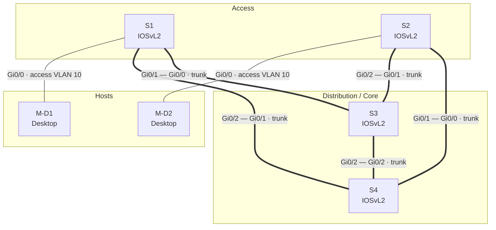

# L2 Lab — Redundant Switched Campus Network


A four-switch, two-host Layer 2 lab built in Cisco Modeling Labs (CML). Two access
switches dual-home into a distribution pair, deliberately creating physical loops
that Per-VLAN Spanning Tree (PVST) resolves. The lab demonstrates VLAN
segmentation, 802.1Q trunking, native-VLAN hardening, and edge-port protection.

---

## Objective

Design and verify a resilient switched access layer where:

- End hosts are segmented into VLANs and carried over tagged uplinks.
- Every access switch has **two independent paths** to the core, so a single link
  or distribution-switch failure does not isolate a host.
- The resulting L2 loops are managed by spanning tree rather than causing a
  broadcast storm.
- Edge ports facing hosts converge instantly and are protected against rogue
  switches.

---

## Topology



*Thick lines are 802.1Q trunks; thin lines are host-facing access ports. The
five inter-switch trunks form loops that PVST breaks by blocking redundant paths.*

---

## Node Inventory

| Node  | Role                | Type      | Node Definition |
|-------|---------------------|-----------|-----------------|
| S1    | Access switch       | Switch    | `iosvl2`        |
| S2    | Access switch       | Switch    | `iosvl2`        |
| S3    | Distribution/core   | Switch    | `iosvl2`        |
| S4    | Distribution/core   | Switch    | `iosvl2`        |
| M-D1  | End host            | Desktop   | `desktop`       |
| M-D2  | End host            | Desktop   | `desktop`       |

## VLAN Plan

| VLAN | Purpose               | Where used                                   |
|------|-----------------------|----------------------------------------------|
| 10   | Data (end hosts)      | Access ports to M-D1 / M-D2; allowed on trunks |
| 20   | Data (reserved)       | Allowed on all trunks; no hosts assigned yet |
| 99   | Native / unused       | Native VLAN on every trunk (not used for data) |

> Placing an unused VLAN (99) as the trunk native VLAN keeps user traffic off the
> native VLAN — a standard hardening step against VLAN-hopping.

## Cabling / Link Map

| Link | A-side          | B-side          | Mode           |
|------|-----------------|-----------------|----------------|
| L0   | S1 Gi0/0        | M-D1 eth0       | Access (VLAN 10) |
| L1   | S2 Gi0/0        | M-D2 eth0       | Access (VLAN 10) |
| L2   | S3 Gi0/0        | S1 Gi0/1        | Trunk          |
| L3   | S4 Gi0/0        | S2 Gi0/1        | Trunk          |
| L4   | S3 Gi0/1        | S2 Gi0/2        | Trunk          |
| L5   | S4 Gi0/1        | S1 Gi0/2        | Trunk          |
| L6   | S3 Gi0/2        | S4 Gi0/2        | Trunk          |

Each access switch (S1, S2) reaches **both** distribution switches (S3, S4), and
the distribution pair is directly interconnected — a near-full mesh that provides
path redundancy.

---

## Design Details

### VLAN segmentation
Hosts are placed into VLAN 10 at the access edge. VLANs are defined and named on
the switches; the CML config export omits the `vlan` definition stanzas, but the
access/trunk assignments below reference them.

### 802.1Q trunking
All inter-switch links are hardcoded trunks with encapsulation and VLAN pruning
made explicit rather than left to negotiation:

```text
interface GigabitEthernet0/1
 switchport trunk encapsulation dot1q
 switchport trunk allowed vlan 10,20
 switchport trunk native vlan 99
 switchport mode trunk
 switchport nonegotiate
```

- `switchport mode trunk` + `switchport nonegotiate` disable DTP, so trunks never
  form by accident.
- `allowed vlan 10,20` prunes every other VLAN off the uplinks.
- `native vlan 99` moves the untagged VLAN away from any data VLAN.

### Loop prevention (PVST)
With five trunks between four switches, the topology contains physical loops. Every
switch runs `spanning-tree mode pvst`, so a spanning tree is computed per VLAN and
redundant links are placed into a blocking state until needed.

### Edge-port protection
Host-facing access ports converge immediately and reject unexpected switches:

```text
interface GigabitEthernet0/0
 switchport mode access
 switchport access vlan 10
 spanning-tree portfast edge
 spanning-tree bpduguard enable
```

- **PortFast** skips the listening/learning delay for end devices.
- **BPDU Guard** err-disables the port if it ever receives a BPDU, preventing a
  rogue switch from joining or looping the network through a host port.

---

## How to Run

1. Open Cisco Modeling Labs.
2. **Import Lab** → select `L2_Lab.yaml`.
3. Start all nodes and open a console to each switch.
4. Suggested verification commands:

```text
show spanning-tree vlan 10
show interfaces trunk
show vlan brief
show interfaces status
```

Ping between **M-D1** and **M-D2** to confirm intra-VLAN reachability across the
switched core, then shut a trunk (e.g. `interface Gi0/1 → shutdown` on S1) and
confirm connectivity survives via the redundant path.

---

## Skills Demonstrated

- VLAN design and access-layer segmentation
- 802.1Q trunk configuration with explicit allowed-VLAN pruning
- Native-VLAN hardening against VLAN hopping
- Spanning Tree (PVST) in a loop-redundant topology
- Edge-port security with PortFast + BPDU Guard
- Building and documenting labs in Cisco Modeling Labs

---

## Possible Extensions

Ideas to grow this lab into a fuller portfolio piece:

- **Set the STP root deterministically** — assign `spanning-tree vlan 10,20 root
  primary` on a distribution switch (S3) and `root secondary` on S4 instead of
  relying on the default lowest-MAC election.
- **Add VLAN 20 hosts** and a **router-on-a-stick or L3 switch** for inter-VLAN
  routing.
- **EtherChannel** the S3–S4 interconnect (or bundle access uplinks) for more
  bandwidth and faster failover.
- **Management** — add SVIs, enable/vty passwords, and SSH-only access.
- **DHCP snooping / port security** on access ports.

---

## Files

| File          | Description                                   |
|---------------|-----------------------------------------------|
| `L2_Lab.yaml` | CML topology export (nodes, links, configs)   |
| `README.md`   | This document                                 |
