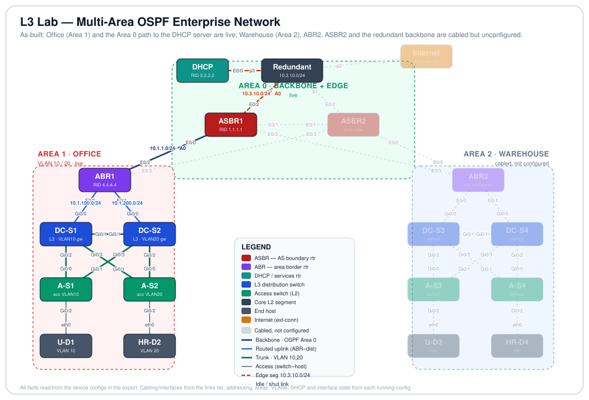

# L3 Lab — Multi-Area OSPF Enterprise Network


-005073)
-0b7285)


## Objective

This lab builds a two-site enterprise network — an **Office** site and a **Warehouse** site, each carrying two user VLANs (10 and 20) — joined by an OSPF routed core. It demonstrates a Layer-3 distribution layer (multilayer switches doing inter-VLAN routing on SVIs and running OSPF), **multi-area OSPF** (each site is its own area behind an Area Border Router riding an Area 0 backbone), **centralized DHCP with relay** across the routed core, and access-layer hardening. The end goal is that a client in an Office VLAN leases an address from a central DHCP server three routed hops away and reaches the rest of the network.

**As-built state (read this first).** This export is a work in progress and the configs make the current state explicit. The **Office site (Area 1)** and the **Area 0 path to the DHCP server** are fully configured and live. The **Warehouse site (Area 2)** — switches DC-S3/DC-S4/A-S3/A-S4 — plus the Warehouse border router **ABR2**, the redundant edge router **ASBR2**, and every redundant backbone link are **cabled but still at default / shut down**. Nothing below is inferred: every value is read from a device's running-config in the export, and everything not yet configured is called out as such (and collected under *Possible Extensions* as the next build phase).

### Changes from the previous export

The topology is byte-identical to the prior export (same 19 nodes, same 27 links). What changed is that **device configurations are now present** — the earlier export shipped with empty `configuration:` blocks for every node. Configs were added to the eight switches (DC-S1/2/3/4, A-S1/2/3/4) and the five routers (ASBR1, ASBR2, ABR1, ABR2, DHCP). Of those, DC-S1, DC-S2, A-S1, A-S2, ABR1, ASBR1 and DHCP carry a working configuration; DC-S3, DC-S4, A-S3, A-S4 are at defaults; and ABR2 and ASBR2 have all interfaces shut with no routing.

## Topology

<p align="center">
  
</p>

*Solid, coloured nodes/links are configured and live; greyed, dashed elements are cabled but unconfigured (default or shut). Line key: navy = OSPF Area 0 backbone · blue = ABR-to-distribution routed uplink · green = 802.1Q trunk (VLAN 10,20) · gray = access port to host · dashed orange = the 10.3.10.0/24 edge segment. Each endpoint is labelled with its physical interface; active routed links show their subnet.*

## Node Inventory

| Node | Role | Type | `node_definition` | Config state |
|------|------|------|-------------------|--------------|
| Internet | Internet edge / outside world | External connector | `external_connector` | cabled; no L3 yet |
| ASBR1 | Edge router on the Area 0 segment (RID 1.1.1.1) | Router | `iol-xe` | configured (E0/0, E0/2) |
| ASBR2 | Redundant edge router | Router | `iol-xe` | all interfaces shut |
| ABR1 | Area Border Router, Area 0 ↔ Area 1 / Office (RID 4.4.4.4) | Router | `iol-xe` | configured |
| ABR2 | Area Border Router, Area 0 ↔ Area 2 / Warehouse | Router | `iol-xe` | all interfaces shut |
| DHCP | Central DHCP server + Area 0 router (RID 2.2.2.2) | Router | `iol-xe` | configured |
| Redundant | Core L2 segment (Internet / DHCP / ASBRs) | Unmanaged switch | `unmanaged_switch` | n/a (unmanaged) |
| DC-S1 | Office L3 distribution — VLAN 10 gateway | Multilayer switch | `iosvl2` | configured |
| DC-S2 | Office L3 distribution — VLAN 20 gateway | Multilayer switch | `iosvl2` | configured |
| DC-S3 | Warehouse distribution | Switch | `iosvl2` | default (unconfigured) |
| DC-S4 | Warehouse distribution | Switch | `iosvl2` | default (unconfigured) |
| A-S1 | Office access switch (U-D1, VLAN 10) | Switch | `iosvl2` | configured |
| A-S2 | Office access switch (HR-D2, VLAN 20) | Switch | `iosvl2` | configured |
| A-S3 | Warehouse access switch | Switch | `iosvl2` | default (unconfigured) |
| A-S4 | Warehouse access switch | Switch | `iosvl2` | default (unconfigured) |
| U-D1 | Office end host (VLAN 10, on A-S1) | Desktop | `desktop` | DHCP client |
| HR-D2 | Office end host (VLAN 20, on A-S2) | Desktop | `desktop` | DHCP client |
| U-D3 | Warehouse end host | Desktop | `desktop` | idle |
| HR-D4 | Warehouse end host | Desktop | `desktop` | idle |

## Addressing & Segmentation

All values are read from the running-configs.

### OSPF (process 1)

| Router | Router-ID | Interfaces → area | Notes |
|--------|-----------|-------------------|-------|
| ABR1 | 4.4.4.4 | E0/2 `10.1.1.0` → area 0; E0/0 `10.1.100.0`, E0/1 `10.1.200.0` → area 1 | True ABR (Office ↔ backbone) |
| ASBR1 | 1.1.1.1 | E0/0 `10.1.1.0` → area 0; E0/2 `10.3.10.0` → area 0 | Area 0 only today (see note) |
| DHCP | 2.2.2.2 | E0/0 `10.3.10.0` → area 0 | `passive-interface default`, active only on E0/0 |
| ABR2 | — | — | not configured (all interfaces shut) |
| ASBR2 | — | — | not configured (all interfaces shut) |

DC-S1 and DC-S2 also run OSPF process 1 into **area 1**, advertising their SVI subnet and their routed uplink (DC-S1: `10.1.10.0`, `10.1.100.0`; DC-S2: `10.1.20.0`, `10.1.200.0`), and each carries a default static route toward ABR1.

### IP addressing

| Subnet | Area | Endpoints |
|--------|------|-----------|
| `10.1.10.0/24` | 1 | VLAN 10 (Office). SVI on DC-S1 = `.2`; DHCP-assigned gateway `.1` (see extensions) |
| `10.1.20.0/24` | 1 | VLAN 20 (Office). SVI on DC-S2 = `.2`; DHCP-assigned gateway `.1` |
| `10.1.100.0/24` | 1 | DC-S1 Gi0/0 `.1` ↔ ABR1 E0/0 `.2` (routed uplink) |
| `10.1.200.0/24` | 1 | DC-S2 Gi0/0 `.1` ↔ ABR1 E0/1 `.2` (routed uplink) |
| `10.1.1.0/24` | 0 | ABR1 E0/2 `.2` ↔ ASBR1 E0/0 `.1` (backbone) |
| `10.3.10.0/24` | 0 | Edge segment: ASBR1 E0/2 `.11`, DHCP E0/0 `.5` (ASBR2 `.x` shut, Internet uplink) |

### VLANs

| VLAN | Subnet | SVI / gateway | Access ports |
|------|--------|---------------|--------------|
| 10 | `10.1.10.0/24` | DC-S1 `Vlan10` = 10.1.10.2 | A-S1 Gi0/2 → U-D1 |
| 20 | `10.1.20.0/24` | DC-S2 `Vlan20` = 10.1.20.2 | A-S2 Gi0/2 → HR-D2 |

*CML config exports drop the `vlan`/name-definition stanzas, so VLAN 10/20 are referenced by trunk and SVI/access commands but are not separately named in the export.* Warehouse VLAN subnets `10.2.10.0/24` and `10.2.20.0/24` appear on the canvas annotations but are **not yet configured** on any Warehouse device.

### DHCP (server = the `DHCP` router, 10.3.10.5)

| Pool | Network | default-router | Excluded |
|------|---------|----------------|----------|
| `AREA1V10` | 10.1.10.0/24 | 10.1.10.1 | 10.1.10.1 – 10.1.10.10 |
| `AREA10V2` | 10.1.20.0/24 | 10.1.20.1 | 10.1.20.1 – 10.1.20.10 |

Both Office SVIs relay to the server with `ip helper-address 10.3.10.5`.

## Cabling / Link Map

Every link from the `links` list, interfaces resolved from each node's interface table. **State** reflects the running-config (a link is *idle* when either end is shut or unconfigured).

| Link | A-side | B-side | Purpose | State |
|------|--------|--------|---------|-------|
| l0 | DC-S1 Gi0/1 | DC-S2 Gi0/1 | Office inter-distribution trunk (VLAN 10,20) | active |
| l1 | DC-S1 Gi0/2 | A-S1 Gi0/0 | Distribution ↔ access trunk (Office) | active |
| l4 | DC-S2 Gi0/3 | A-S1 Gi0/1 | Distribution ↔ access trunk (Office, 2nd uplink) | active |
| l3 | DC-S1 Gi0/3 | A-S2 Gi0/1 | Distribution ↔ access trunk (Office, 2nd uplink) | active |
| l2 | DC-S2 Gi0/2 | A-S2 Gi0/0 | Distribution ↔ access trunk (Office) | active |
| l6 | A-S1 Gi0/2 | U-D1 eth0 | Access port, VLAN 10 (PortFast + BPDU Guard) | active |
| l5 | A-S2 Gi0/2 | HR-D2 eth0 | Access port, VLAN 20 (PortFast + BPDU Guard) | active |
| l17 | ABR1 E0/0 | DC-S1 Gi0/0 | Routed uplink `10.1.100.0/24` (Area 1) | active |
| l18 | ABR1 E0/1 | DC-S2 Gi0/0 | Routed uplink `10.1.200.0/24` (Area 1) | active |
| l19 | ABR1 E0/2 | ASBR1 E0/0 | OSPF Area 0 backbone `10.1.1.0/24` | active |
| l22 | ASBR1 E0/2 | Redundant port0 | Edge segment `10.3.10.0/24` (Area 0) | active |
| l26 | DHCP E0/0 | Redundant port3 | Edge segment `10.3.10.0/24` (DHCP server) | active |
| l14 | Redundant port2 | Internet port | Uplink to outside (no L3/route configured yet) | cabled |
| l7 | DC-S3 Gi0/1 | DC-S4 Gi0/1 | Warehouse inter-distribution trunk | idle |
| l8 | DC-S3 Gi0/2 | A-S3 Gi0/0 | Distribution ↔ access (Warehouse) | idle |
| l11 | DC-S4 Gi0/3 | A-S3 Gi0/1 | Distribution ↔ access (Warehouse) | idle |
| l10 | DC-S3 Gi0/3 | A-S4 Gi0/1 | Distribution ↔ access (Warehouse) | idle |
| l9 | DC-S4 Gi0/2 | A-S4 Gi0/0 | Distribution ↔ access (Warehouse) | idle |
| l12 | A-S3 Gi0/2 | U-D3 eth0 | Access port to host (Warehouse) | idle |
| l13 | A-S4 Gi0/2 | HR-D4 eth0 | Access port to host (Warehouse) | idle |
| l15 | ABR2 E0/0 | DC-S3 Gi0/0 | Routed uplink, Warehouse ↔ ABR2 | idle (ABR2 shut) |
| l16 | ABR2 E0/1 | DC-S4 Gi0/0 | Routed uplink, Warehouse ↔ ABR2 | idle (ABR2 shut) |
| l20 | ASBR2 E0/0 | ABR2 E0/2 | OSPF Area 0 backbone | idle (both shut) |
| l21 | ASBR1 E0/1 | ASBR2 E0/1 | OSPF Area 0 backbone (ASBR ↔ ASBR) | idle (both shut) |
| l25 | ASBR1 E0/3 | ABR2 E0/3 | OSPF Area 0 backbone | idle (both shut) |
| l24 | ASBR2 E0/3 | ABR1 E0/3 | OSPF Area 0 backbone | idle (both shut) |
| l23 | ASBR2 E0/2 | Redundant port1 | Edge segment `10.3.10.0/24` | idle (ASBR2 shut) |

## Design Details

Each subsection describes a feature that is configured in the export, with a minimal snippet lifted from the running-config.

**Layer-3 distribution with per-VLAN SVIs.** The Office distribution switches are multilayer: each owns one VLAN's gateway SVI, a routed uplink to the ABR, and OSPF. This splits the two VLAN gateways across the two switches (VLAN 10 on DC-S1, VLAN 20 on DC-S2) rather than co-locating them.

```text
! DC-S1
interface GigabitEthernet0/0
 no switchport
 ip address 10.1.100.1 255.255.255.0
interface Vlan10
 ip address 10.1.10.2 255.255.255.0
 ip helper-address 10.3.10.5
router ospf 1
 network 10.1.10.0 0.0.0.255 area 1
 network 10.1.100.0 0.0.0.255 area 1
ip route 0.0.0.0 0.0.0.0 10.1.100.2
```

**VLAN segmentation and 802.1Q trunking.** All inter-switch links (distribution-to-distribution and distribution-to-access) are dot1q trunks pruned to the two user VLANs, negotiation disabled.

```text
interface GigabitEthernet0/1
 switchport trunk allowed vlan 10,20
 switchport trunk encapsulation dot1q
 switchport mode trunk
 switchport nonegotiate
```

**Access-port hardening.** Host-facing ports on A-S1/A-S2 are single-VLAN access ports with PortFast for fast host convergence and BPDU Guard to shut the port if another switch is plugged in.

```text
! A-S1
interface GigabitEthernet0/2
 switchport access vlan 10
 switchport mode access
 spanning-tree portfast edge
 spanning-tree bpduguard enable
```

**Multi-area OSPF.** ABR1 is the border between Area 1 (Office) and Area 0 (backbone); its interfaces are assigned to areas per network statement, giving the Office its own LSA flooding domain that summarizes into the backbone.

```text
! ABR1
interface Ethernet0/2
 ip address 10.1.1.2 255.255.255.0
router ospf 1
 router-id 4.4.4.4
 network 10.1.1.0 0.0.0.255 area 0
 network 10.1.100.0 0.0.0.255 area 1
 network 10.1.200.0 0.0.0.255 area 1
```

**Centralized DHCP with relay.** A single DHCP router on the Area 0 edge segment serves both Office VLANs; the SVIs relay broadcasts to it with `ip helper-address`. The server runs OSPF (passive everywhere except its edge interface) so its reply route back into the Office is learned dynamically.

```text
! DHCP (10.3.10.5)
ip dhcp excluded-address 10.1.10.1 10.1.10.10
ip dhcp pool AREA1V10
 network 10.1.10.0 255.255.255.0
 default-router 10.1.10.1
router ospf 1
 router-id 2.2.2.2
 passive-interface default
 no passive-interface Ethernet0/0
 network 10.3.10.0 0.0.0.255 area 0
```

**Spanning tree.** The switches run PVST+ (`spanning-tree mode pvst`) and the routers run Rapid-PVST. Each Office access switch dual-homes to both distribution switches (A-S1 → DC-S1 *and* DC-S2; A-S2 likewise), so STP is actively blocking one of each pair's redundant uplinks. Root-bridge priorities are left at default in this export.

**Redundant edge and Warehouse (cabled, not yet configured).** The wiring provides a near-full backbone mesh (ABR1/ABR2/ASBR1/ASBR2) and a redundant edge segment, but today only ASBR1's E0/0 and E0/2 are up: ASBR1 E0/1 and E0/3, all of ASBR2, and all of ABR2 are shut, and the Warehouse switches are at defaults. The redundancy is designed into the topology but is a pending build step, not an active feature.

## How to Run & Verify

**Import.** In CML, *Import* → select `L3_Lab.clean.yaml` → start all nodes. Devices boot with the configs shown above (Warehouse devices come up at defaults by design).

The tests below prove the parts that are configured today.

| Test (where) | Command | Expected result |
|--------------|---------|-----------------|
| Office host leased an address | U-D1 / HR-D2: `ipconfig` / `ip a` | Address in `10.1.10.0/24` (U-D1) or `10.1.20.0/24` (HR-D2) |
| DHCP bindings | DHCP: `show ip dhcp binding` | One binding per Office host that has leased |
| Relay working | DC-S1: `show ip interface Vlan10` \| i Helper | Helper address `10.3.10.5` present |
| Trunks / VLANs | DC-S1, A-S1: `show interfaces trunk`, `show vlan brief` | Gi0/1–Gi0/3 trunking VLAN 10,20; A-S1 Gi0/2 access VLAN 10 |
| STP blocking a redundant uplink | A-S1: `show spanning-tree vlan 10` | Root via one distribution switch, the second uplink in BLK |
| Inter-VLAN routing | U-D1 (VLAN 10) → ping HR-D2 (VLAN 20) | Success once host gateways are correct (see extensions) |
| OSPF adjacencies | ABR1: `show ip ospf neighbor` | FULL with DC-S1, DC-S2 (area 1) and ASBR1 (area 0) |
| ABR / inter-area LSAs | ABR1: `show ip ospf database` | Router flagged ABR; type-3 summaries between areas |
| Reach the DHCP server | U-D1 → ping `10.3.10.5` | Success (proves Area 1 → Area 0 routing end-to-end) |

## Skills Demonstrated

- Multilayer (L3) switching: SVIs, routed uplinks, and a distribution switch participating in OSPF.
- VLAN design with 802.1Q trunking and access-port assignment across a dual-homed access layer.
- Access-port hardening with PortFast and BPDU Guard.
- Multi-area OSPF with a correctly-scoped ABR (area 0 backbone plus a per-site area) and explicit router-IDs.
- Centralized DHCP with cross-subnet relay (`ip helper-address`) and pool/exclusion design, proven by an Office host completing its lease.
- OSPF `passive-interface default` on a services router so it advertises only where it should.
- Reading a CML export as the source of truth — deriving every fact from the device configs and reporting the real build state, including what is not yet done.

## Possible Extensions

- **Build the Warehouse (Area 2).** Configure DC-S3/DC-S4 (SVIs for VLAN 10/20 in `10.2.x.0/24`, trunks, OSPF area 2) and A-S3/A-S4 (trunks + access ports), mirroring the Office.
- **Bring up ABR2 and ASBR2.** Un-shut and address their interfaces and add OSPF so the Warehouse gets a border router and the redundant backbone/edge actually forward — the cabling is already in place (l20/l21/l23/l24/l25).
- **Fix the host default gateway.** The pools hand out `default-router 10.1.10.1 / 10.1.20.1`, but the only SVIs are `.2`. If a first-hop-redundancy virtual IP at `.1` is the intent, it isn't configured yet — today an Office client receives a gateway address no device owns, so off-subnet traffic will fail. Either point the pool at `.2` or add HSRP/VRRP with a `.1` VIP.
- **Add first-hop redundancy for the split gateways.** VLAN 10's gateway lives only on DC-S1 and VLAN 20's only on DC-S2; if a distribution switch fails, that VLAN loses its gateway even though the other switch is up. HSRP/VRRP across the pair (with the VIP at `.1`) closes this and matches the pool's `default-router`.
- **Make ASBR1/ASBR2 actual ASBRs.** Neither injects an external or default route today, and the Internet link (`l14`) has no addressing or NAT — so there is no Internet path yet. Add edge addressing, a default route/NAT, and `default-information originate` into OSPF.
- **Minor:** the second DHCP pool is named `AREA10V2` (appears to be a typo for `AREA1V20`); and OSPF root-bridge priorities are default (consider setting DC-S1/DC-S2 as primary/secondary roots per VLAN for deterministic STP).

## Files

| File | Description |
|------|-------------|
| `README.md` | This documentation. |
| `topology.svg` | Hand-built topology diagram (embedded above), showing configured vs. unconfigured elements. |
| `L3_Lab.clean.yaml` | Sanitized CML export — auto-generated Cisco banner/EULA blocks stripped from all switches; all real configuration preserved (19 nodes, 27 links, parse-verified). |

---

*Documentation derived entirely from the device running-configs in the CML export `L3_Lab`. Cabling and interfaces come from the `links` list; addressing, areas, VLANs, DHCP and interface up/shut state come from each node's configuration.*
